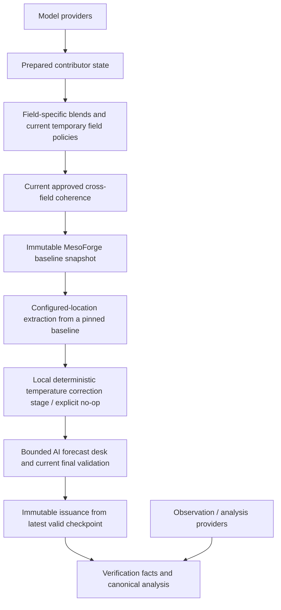
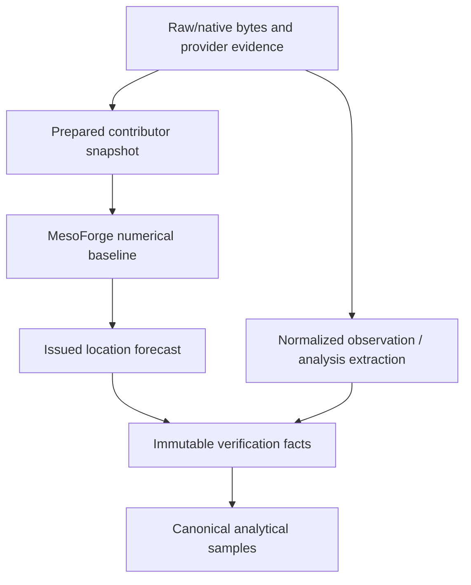
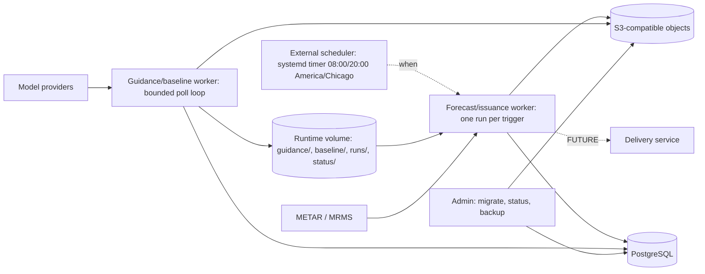

# MesoForge Architecture

MesoForge is a Python modular monolith for configured-location weather forecasts.
Its numerical forecast is a field-specific blend built from retained model
evidence, followed by explicit coherence checks, immutable issuance and verification.

This document describes the technical structure of the current system and marks
the target components that do not exist yet. It is not a forecast-policy change.

| Reference | Responsibility |
|---|---|
| [VISION](VISION.md) | Canonical product direction: what MesoForge is becoming |
| **ARCHITECTURE** | Current technical structure and its relationship to the target |
| [README](README.md) | Current capabilities, setup, commands and development checks |
| [AGENTS](AGENTS.md) | Guardrails for changing the repository |
| Active contracts | Narrow data/scientific semantics referenced below |
| Durable ADRs | Why historical technical decisions were made |
| `docs/archive/` | Historical reasoning, not instructions or current behavior |

Current code is authoritative for implemented behavior. VISION is authoritative
for target direction. A future relationship or proposed field policy is not an
implemented scientific rule merely because it appears in an architecture diagram.

## A. System overview

**The blend is the forecast.** Models remain contributors and evidence, including
when their active weight is zero. A single universal blending equation would be
scientifically wrong: vectors, accumulations, probabilities and categories have
different meanings.



The main boundaries are implemented as commands. The hosted deployment (section N)
runs them as two roles of one image: a polling guidance/baseline worker and a
scheduled forecast/issuance worker. Background means numerical preparation runs
before a location job; no VPS deployment has been performed.

The issued product currently contains 36 hourly views of a local surface-weather
canvas. Temperature, moisture, wind, QPF and temporary probability/category fields
coexist with evidence-only fields. Missing evidence stays visible.

The principal source packages are:

| Package | Job |
|---|---|
| `application/` | Compose commands, prepared artifacts, snapshots, issuance and read interfaces |
| `guidance/` | Provider products, acquisition, decoding, normalization and capability checks |
| `alignment/` | Native spatial/temporal extraction and wind transformations |
| `forecasting/` | Scientific kernels, field dispatch, coherence and deterministic presentation |
| `observations/` | Station/METAR and MRMS observation-reference semantics |
| `verification/` | Matching eligibility, immutable-fact projections and analytical canonicalization |
| `catalog/`, `contracts/` | Configuration, identities and typed data boundaries |
| `storage/`, `provenance/` | Immutable payloads, metadata, transformations and lineage |

The retained Phase 2 station path is a separate scientific/reference consumer of
shared kernels. Its old station/domain limits do not define the V2 product.

## B. Application roles

Two roles organize one codebase. They are not a collection of weather microservices.

| Guidance / baseline role | Forecast / issuance role |
|---|---|
| Discover actual provider availability | Resolve configured coordinates |
| Acquire and normalize selected evidence | Pin one published baseline |
| Reuse raw/prepared guidance across locations | Read its saved local domain/reference view |
| Publish prepared contributor state | Produce deterministic reports |
| Build fields and current coherence; configured candidate shadows | Apply local correction/no-op, bounded AI desk and immutable issuance |
| Publish a complete numerical baseline | Read back and participate in verification |

The implemented application boundaries are:

```text
refresh_guidance
    publishes latest_complete
        ↓
build_baseline
    publishes latest_baseline
        ↓
forecast_from_baseline
    extracts configured domains; --issue persists versions
```

These steps have independent success/failure boundaries. Publishing new evidence
does not invalidate the previous numerical baseline if building its replacement fails.

[`prospective_cycle`](src/mesoforge/application/prospective_cycle.py) is the on-demand
development/operator composition of these boundaries. Its default registry is
[`configs/locations.json`](configs/locations.json). It reads an aware runtime UTC
clock, refreshes shared guidance once, builds the baseline, then pins the exact
returned baseline for the configured batch. The location analysis clock is sampled
after background completion and its UTC hour is floored using the existing rule.
An explicit replay-reference override is separate from this normal current-time path.

The runner does not merge the two artifacts/publication transactions or implement
meteorology. Temperature/QPF verification and immutable issuance use the existing
location boundary, with field/location failures isolated. Existing decision-window
lookup and PostgreSQL advisory locking guard primary issuance. When all configured
locations already have an issued version for the current hour and a valid current baseline
exists, the runner can reuse it without background preparation and retry verification
without creating duplicate primary forecasts. A background failure remains explicit;
the previous good prepared/baseline pointers remain independent and available.

Temperature observation acquisition/verification remains separately callable through
`automatic_verification`. Normal baseline issuance also attempts prior temperature
and bounded QPF verification independently before its issuance lock. QPF accumulation
resolves retained/fixed-hour MRMS evidence; explicit extraction-based commands remain.
Neither observation failure gates a new numerical issuance.

The older `forward_run` verifies temperature, discovers/prepares guidance and blends
inline. Its module identifies it as a development/compatibility path. It is not the
normal baseline-consuming location path.

Hosted operation assigns these roles to two workers sharing PostgreSQL,
S3-compatible storage and one runtime volume (section N). An external scheduler
chooses when the forecast worker runs. Model selection, meteorology, cutoffs and
verification belong to MesoForge, not scheduler or workflow YAML.

## C. Artifact hierarchy



| Artifact | Question answered | Identity and retention |
|---|---|---|
| Raw/native evidence | What did the provider supply, and when was it acquired? | Original bytes, URL/object identity, checksum and timestamps |
| Prepared contributor state | What normalized guidance was available? | Prepared files, native semantics, selection evidence and source manifests |
| Baseline snapshot | What numerical forecast did current policies construct? | Immutable domains/views, policy/coherence identity and exact prepared lineage |
| Learning policy / variant | What explicit transformation of its parent was evaluated? | Immutable policy/version, parent stage, compact field overlay, role, evidence cutoff and code/config identity |
| Issued forecast | What was issued for this coordinate at this time? | Issued UUID, actual issuance, reference time, payload digest and baseline lineage |
| Verification fact | What exact forecast/evidence comparison was evaluated? | Immutable field/stage-specific evidence and explicit status |
| Canonical sample | Which comparisons may count analytically? | Deterministic read-only selection/deduplication of facts |

The two current pointers have different meanings:

| Pointer | Refers to | Does not mean |
|---|---|---|
| `latest_complete.json` | A complete prepared contributor snapshot | A blended forecast or an issuance |
| `latest_baseline.json` | A complete built MesoForge numerical baseline | The newest provider run regardless of eligibility |

Their current schema identities are `mesoforge.prepared-snapshot.v1` and
`mesoforge.baseline-snapshot.v1`. Historical names are retained rather than renamed
to make old artifacts conform to today's terminology.

A later observation or model run never rewrites an issued forecast. An old artifact
that lacks modern cutoff or baseline metadata remains historical evidence; readers
must not invent that metadata to make it look equivalent to a new issuance.

## D. Storage and provenance

PostgreSQL and S3-compatible object storage are the shared durable storage boundary.
Prepared and baseline collections also currently use explicitly configured local
filesystem roots outside Git. They are not secretly mirrored into PostgreSQL.

| Storage | Current responsibilities |
|---|---|
| PostgreSQL | Artifact manifests, stored-object references, transformation activities, configuration/provenance records, issued-version metadata, append-only policy-governance events, bounded analytical attributes and advisory locks |
| S3-compatible object store | Immutable content-addressed bytes: issuances, raw observation artifacts, normalized extracts and verification facts |
| Guidance filesystem root | Retained model bytes/indexes, prepared arrays/manifests, refresh outcomes and `latest_complete` |
| Baseline filesystem root | Immutable compressed domains, metadata/source-reference tables, cutoff proof and `latest_baseline` |

`ForecastIssuanceService.issue` serializes and hashes the full forecast, stores it
with `put_if_absent`, verifies its bytes, then commits metadata in PostgreSQL.
A failed payload write/readback must not become a successful issuance row.

The general `ArtifactService` records transformations against immutable input and
configuration identities. New source bytes/revisions get new identities; a repeat
of the same idempotent operation can reuse its existing result.

Readback verifies content digests. A metadata row is not sufficient proof that its
payload is still present or correct.

Baselines use [CompactCodec](src/mesoforge/application/baseline_codec.py) to preserve
the existing grid schema while factoring repeated metadata. Exact source-owned JSON
subtrees use document hashes and JSON pointers; other repeated metadata is pooled
once per baseline. Numerical values are not recalculated during decoding.

This is limited baseline compaction, not general storage normalization. Issuance
still expands to the rich historical payload, which can exceed hundreds of MB.
Referenced source documents must remain available for baseline readback.

Durable rationale: [artifact identity](docs/decisions/0002-artifact-identity-and-provenance.md),
[configuration snapshots](docs/decisions/0003-configuration-snapshots.md) and
[PostgreSQL/S3](docs/decisions/0004-postgresql-and-s3-storage.md).

## E. Configured locations and spatial representation

Latitude/longitude are the only required geographic inputs. Optional ID, display name
and timezone do not change geographic identity. Users do not configure station IDs,
counties, model cells, bounding boxes or editable polygons.

```json
{
  "locations": [
    {"lat": 44.98859, "lon": -93.25557, "name": "Minneapolis"},
    {"lat": 36.7378, "lon": -119.7871, "name": "Fresno"}
  ]
}
```

Three spatial concepts must remain distinct:

| Representation | Current implementation |
|---|---|
| Native preparation coverage | Coordinate-derived 150 km envelopes, satisfying the 50 km minimum buffer; overlapping envelopes merge and distant regions remain separate |
| Local MesoForge context grid | 7×7 nodes, 6 km spacing, ±18 km projected offsets: 36 km between outer node centers |
| Editable portion | Nested 3×3 nodes, ±6 km projected offsets: 12 km between outer node centers |

The 150 km preparation envelope is **not** the current 36 km local context grid.
The extra prepared coverage remains source evidence, not an implied larger editable
or delivered MesoForge raster.

The grid is a WGS84 azimuthal-equidistant lattice centered on the coordinate. It has
49 context nodes, nine editable nodes and 40 context-only nodes. Extents describe
node centers, not raster-cell edges. Winds remain earth-relative U/V.

Each node records editable/context membership, whether it is the forecast point,
and signed distance to the editable boundary. That distance permits a future taper;
no taper or forecast edit is currently applied.

The exact configured point is the center node. Its forecast is extracted from the
saved grid, not independently recalculated or interpolated a second time. Historical
grid v1 readers remain available. Arbitrary off-center interpolation is not the
current baseline extraction contract.

Current geometry is a measured implementation choice, not permanent product doctrine.
There is no continental MesoForge common grid.

Background construction materializes exact configured domains and reference-hour
views. More source coverage does not imply a saved baseline exists for every point
inside it. A new coordinate or missing reference view requires a background build.
The location command reports `coverage_required` or `no_current_baseline`; it does
not reblend or call providers to hide the miss.

Adjacent locations share loaded prepared guidance and metadata. Distinct centered
lattices remain separate numerical domains; duplicate configured centers share one.

Code: [region planning](src/mesoforge/application/spatial_coverage.py),
[`derive_grid_geometry`](src/mesoforge/application/local_surface_grid.py),
[`BaselineView.forecast`](src/mesoforge/application/baseline_snapshot.py).

## F. Guidance acquisition and eligibility

Provider adapters describe native products and capability limits. Configuration and
selection preserve source cycles, source leads, actual valid times, units, grids,
URLs, index/message identities and acquisition evidence.

| Source | Current use |
|---|---|
| HRRR | Required active temperature/surface contributor; hourly QPF evidence |
| GFS | Required active temperature/surface contributor; interval-normalized QPF evidence |
| RAP | Zero-weight shadow, with supported native fields and explicit gaps |
| ECMWF deterministic IFS | Zero-weight shadow; native three-hourly times, no hourly interpolation |
| NBM | Temporary active hourly PoP, total cloud and thunder; other native evidence where attached |
| Other probabilistic products | Separate shadow events when retained; never automatic replacements for active PoP |

`current_model_set.select_model_set` inspects actual provider metadata rather than
assuming a nominal cycle is available. It records examined/rejected candidates and
the exact selected identities. Preparation revalidates those identities before using
the bytes. Metadata discovery alone is not proof of decoded scientific correctness.

Models align by actual valid time, not equal lead numbers or equal cycle times.
Each required model must cover the initial 36-hour window under its native cadence.
The background refresh can prepare an extension beyond 36 hours, up to the supported
42-hour collection, only where accepted source cycles already provide it.

`refresh_guidance` explicitly permits RAP/IFS discovery or preparation shortfalls as
missing shadow evidence. Missing required HRRR/GFS still fails. Optional shadows are
never promoted or silently substituted. The lower-level selection command can retain
its stricter complete-shadow mode for explicit experiments.

Required active NBM products and their coverage are checked separately. Optional
visibility/winter/shadow attachments do not become required active policies merely
because their adapters exist. Not every normal refresh attaches every optional field.

QPF selection does not choose a new temperature cycle merely to fill a missing QPF
message. It retains exact available hourly evidence or explicit missingness. GFS
bucket differences use their existing accumulation/reset rules, not arbitrary
redistribution.

Each discovery/attachment has its own cutoff. The original model-selection cutoff
does not automatically cover a later NBM or other attachment. Source information
retains discovery, availability and acquisition separately.

```text
source cycle / native valid time
    != provider availability / discovery cutoff
    != acquisition time
    != prepared completion / publication
    != background analysis cutoff
    != location analysis / actual issuance
```

`check_information_cutoff` validates retained source/index availability and retrieval
times, discovery cutoffs, snapshot completion and publication against the applicable
analysis cutoff. Missing historical proof is a limitation or failure, never a
fabricated timestamp.

The finished prepared snapshot is load-validated offline before publication.
Failed refreshes retain diagnostics and the last good pointer; they do not publish
a partially prepared replacement. Raw inputs and prepared artifacts stay outside Git.

Code: [current model selection](src/mesoforge/application/current_model_set.py),
[refresh](src/mesoforge/application/refresh_guidance.py),
[prepared snapshot/availability proof](src/mesoforge/application/prepared_snapshot.py),
[provider availability boundary](src/mesoforge/guidance/sources/current_availability.py).

## G. Field registry and blend dispatch

[`FieldBlendEngine`](src/mesoforge/forecasting/field_blend.py) is the common active
numerical dispatch boundary. `FIELD_REGISTRY` binds canonical field, semantic kind,
units, policy source, missingness behavior and dependencies. `policy_for` resolves
existing recipes/tables; `blend_field` dispatches their specialized kernels.

Generalized orchestration does not imply generic science. Scalar weighted means,
vector means, gust constraints, exact interval QPF and diagnostics stay distinct.
`BlendState` belongs to one extracted cell/hour and caches dependencies only there.
It never overwrites native contributor evidence.

**The following weights are temporary scientific scaffolding, not the final blend.**

| Field | Active policy and current HRRR/GFS weights | Missingness |
|---|---|---|
| Temperature | `temperature_control_v1`; 70/30 for hours 1–36 | Both required; no weight redistribution |
| Dew point | `phase2-scalar-vector-fallback.v1`; 70/30 hours 1–18, 60/40 hours 19–36 | Approved eligible sole-source row or unavailable |
| Wind | Same table/bands; blend U/V, derive speed/direction | Coupled wind/gust source eligibility; approved subset rows |
| Gust | Same table/bands and source subset as wind | Existing source/final gust rules, no independent fallback set |
| Hourly QPF | `phase2-qpf-fallback.v1`; 70/30 hours 1–18, 60/40 hours 19–36 | Exact compatible hourly intervals; approved subset rows |
| RH | `bolton-1980-relative-humidity-liquid-water.v1` | Derived after coherent T/Td; no independent weights |

The table storage also contains NBM and legacy combinations for other retained
consumers. Their existence does not activate NBM in today's V2 surface/QPF blend.
RAP/IFS preserve native values at zero active weight where available.

Applied row identity/hash, weights, source eligibility, intervals, missing reasons
and contributor values remain saved alongside the resulting field. Temperature's
historical surface projection label remains readable; the containing recipe carries
the actual named/versioned control identity.

Existing scientific kernels remain in use: `blend_scalar`, `blend_vector`,
`blend_gust`, `blend_qpf`, recipe evaluation and the Bolton RH diagnostic. The engine
is not a duplicate implementation of those equations.

### Current canvas outside the migrated blend fields

I = instantaneous; A = exact interval accumulation; P = interval probability;
C = category/state. Storage retains native semantics even where reports convert units.

| Field/evidence | Meaning; canonical units/time | Current delivered status |
|---|---|---|
| Temperature / dew point | 2-m temperatures; K, I | Active scalar blends |
| RH | Liquid-water-relative humidity; %, I diagnostic | Derived from coherent baseline T/Td |
| U/V, speed/direction, gust | Earth-relative wind; m/s, degrees, I | Active vector/gust policy |
| QPF | Total liquid-equivalent precipitation; kg/m², A | Active hourly blend; zero distinct from missing |
| PoP | Chance of >0.254 kg/m² in the exact hour; fraction, P | Temporary NBM-only passthrough |
| Cloud / sky | Entire-column total cover; fraction/percent, I; category | Temporary NBM-only baseline and existing deterministic sky mapping |
| Thunder | Native NBM thunder event; fraction, P | Temporary hourly source; physical event footprint/threshold limitations retained |
| P-type | Native rain/snow/freezing-rain/ice-pellet support; C/I | Temporary complete HRRR/GFS flag agreement |
| SWE | Liquid-equivalent water associated with snow; kg/m², A | Native evidence only; no approved delivered blend |
| Native snowfall amount | Newly accumulated snow depth; m, A | Evidence only; NBM snow-and-sleet differs from HRRR/RAP snow |
| Kuchera snowfall / SLR | Profile-derived ratio and compatible SWE amount; m and ratio | Separate RAP-derived evidence, no active promotion |
| Native SLR | NBM instantaneous SNOWLR; dimensionless, I | Supporting evidence, not an interval-average ratio |
| Visibility | Native horizontal surface visibility; m, I | Evidence only; no active blend or fog inference |
| Freezing-rain liquid | Liquid-equivalent freezing-rain amount; kg/m², A | HRRR/RAP native evidence only |
| Flat ice | NBM flat-surface accretion mass equivalent; kg/m², A | Evidence only; not liquid QPF, radial ice or geometric thickness |
| Additional probability events | Native threshold/window/spatial-support-specific probabilities | Zero-weight evidence; incompatible events stay separate |

P-type disagreement is ambiguous; all-zero flags are unknown, not proof of dryness.
Complete matching multi-type sets remain mixed. There is no temperature-only type
diagnosis or one-source substitution.

Compatible NBM/GEFS six-hour PoP events can be compared descriptively. REFS heavy-rain
neighborhood and ECMWF 24-hour events retain different thresholds/support/windows;
they are not silently converted to hourly PoP. Ensemble fractions are not fabricated.

SWE, new snowfall, total ground snow depth, SLR and ice are different quantities.
The current canvas does not deliver total snow depth or a fixed 10:1 snow estimate.
Kuchera retains its profile inputs and interval-end approximation separately from
native snowfall and native NBM SLR. There is no local derived accretion algorithm.

No evidence-only field is promoted just to make a conditions sentence possible.
Cloud categories use unrounded percentages with existing upper-inclusive boundaries
5/25/50/87/100%; missing active NBM cloud has no shadow fallback.

Policies/kernels: [recipes](src/mesoforge/forecasting/recipes.py),
[retained configuration](configs/phase2-grasston.yaml),
[p-type](src/mesoforge/application/precipitation_type.py),
[cloud](src/mesoforge/forecasting/cloud_cover.py),
[thunder](src/mesoforge/forecasting/thunder.py).
Detailed retained interval/fallback science is scoped in the
[Phase 2 technical contract](docs/data-contracts/phase-2.md).

## H. Cross-field coherence

[`CoherenceEngine.apply_baseline`](src/mesoforge/forecasting/coherence.py) owns finite
dependency ordering for current source validation, constraints and diagnostics.
`RELATIONSHIP_REGISTRY` distinguishes enforced, dependency-only and external-evidence
relationships. `relationship_order` rejects invalid dependencies and cycles.

No open-ended iteration runs until fields appear stable. Every required relationship
executes at most once per state, in a deterministic topological order.

| Order | Current enforced relationship | Exact behavior |
|---|---|---|
| 1 | Native source consistency | Validate source T/Td; validate U/V/gust as a coupled set before selecting affected blend rows |
| 2 | Blended T/Td | Require Td ≤ T + 1e−6 K; inconsistent Td becomes unavailable/inconsistent, not clamped |
| 3 | RH | Derive Bolton liquid-water RH from available consistent T/Td; invalid/missing inputs remain unavailable |
| 4 | Wind diagnostics | Blend validated earth-relative U/V and derive speed/direction; exactly calm direction is undefined |
| 5 | Blended gust | Use the wind contributor subset and existing gust kernel; preserve floor/exclusion flags |

Native gust below its own sustained speed by at most 0.1 m/s is floored in the
working value. A larger shortfall rejects that source's coupled wind/gust inputs.
The native evidence itself is unchanged. A final gust shortfall of at most 1e−6 m/s
uses the established numerical floor; larger invalid inconsistencies are errors.

Coherence reports distinguish validation, derivation, exclusion and actual
adjustment. A successful check is not labeled an adjustment. Current permitted
source unavailability is an explicit outcome, not automatically a failed build.
An exception or missing required execution proof blocks publication.

| Registered relationship | Current execution status |
|---|---|
| QPF ↔ PoP / p-type / thunder / snow and ice | Dependency only |
| P-type ↔ thermal structure | Dependency only |
| Snowfall ↔ SWE ↔ SLR | Dependency only |
| Freezing-rain liquid ↔ thermal structure ↔ ice | Dependency only |
| Visibility ↔ moisture/cloud/precipitation/fog evidence | Dependency only |
| Native Kuchera derivation | Existing external evidence path, not an active coherence correction |

Thus QPF zero does not force PoP or thunder to zero; warm surface temperature does
not prohibit snow; reduced visibility does not become fog. Those scientific rules
have not been approved or implemented by registering the relationships.

`collect_baseline_coherence` counts actual calculated cell-hours and outcomes during
background construction. The manifest records framework identity, enforced policy
identities, execution results and unresolved relationships once at useful scope.
It does not replicate a large provenance report in every cell.

Post-edit validation currently reruns only approved affected-field relationships;
broader meteorological final coherence remains future science. Normal location
extraction does not rerun baseline coherence, and historical manifests do not
acquire retroactive reports.

## I. Background baseline snapshots

[`build_baseline`](src/mesoforge/application/build_baseline.py) resolves and pins one
prepared state, checks source identities/cutoffs, loads shared guidance, builds each
configured domain/reference view and seals an immutable baseline.

```text
pin prepared state
    → prove background cutoff
    → load shared guidance once
    → field blends + temporary field paths + current coherence
    → validate declared geometry/time/field coverage
    → save compressed domains + shared metadata + information proof
    → seal manifest
    → publish latest_baseline
```

The manifest includes exact prepared ID/digest, source cycles, field registry and
policies, current coherence identity/outcome, build/completion/analysis times,
domain geometry, reference windows, field availability and artifact digests.
Completeness means declared views exist and validate; it does not mean every optional
weather field has a numeric value.

Default builds include every usable exact-hour reference view. For a full 42-hour
prepared window, there can be seven distinct 36-hour views. They cannot be replaced
by simply relabeling a slice: current lead-band rows change at hour 19.

Unsupported configured domains are reported individually. A build with no usable
domain fails. Unexpected errors or incomplete required coherence prevent publication.
Previous immutable baselines stay available.

Publication uses the shared persistent OS file-lock implementation with a separate
`.latest_baseline.lock`. Windows byte-range locks and POSIX `flock` coordinate
separate processes. The stable lock file is not unlinked between writers.

Inside the writer lock, baseline ordering is lexicographic by:

1. prepared reference time;
2. prepared publication time;
3. background analysis cutoff;
4. build start time.

Older candidates cannot move the pointer backward. Equal-order distinct candidates
are rejected as ambiguous; republishing the same identity returns the current pointer.
A unique temporary pointer file is flushed/fsynced and atomically replaced.

Prepared publication has its own lock and authoritative reference-time ordering.
Neither pointer is a database lock or a distributed object-store transaction.
The guarantee applies to processes using the same local root and locking protocol.

```text
latest_complete = contributor B
latest_baseline = numerical A
    is valid when B's numerical build failed

retry B successfully
    → new immutable numerical B
    → latest_baseline advances
```

No discovery/download occurs in baseline construction. The guidance worker
(section N) decides when to refresh and rebuild and bounds retries; incremental
affected-field recomputation is not implemented.

## J. Location issuance and read-only presentation

[`forecast_from_baseline`](src/mesoforge/application/forecast_from_baseline.py) is the
normal configured-location entry point. It resolves the pointer once and pins the
manifest ID, validates digests and information proof, then chooses a saved view for
the current UTC reference hour or an explicit covered reference hour.

It checks that background cutoff/build/completion/publication precede the location
analysis cutoff. Later publication of another baseline cannot change the pinned
object. Each requested coordinate reads its saved domain and center forecast.

There is no native-array load, FieldBlendEngine call, baseline coherence execution
or model-provider request during normal extraction. Missing coverage requires a new
background build, never a hidden on-request blend. With issuance enabled, independent
prior-verification attempts may access observation providers while the same baseline
stays pinned. Reports keep these outcomes separate from the issued forecast payload.

| Time | Meaning |
|---|---|
| Reference time | Origin for forecast hours and lead-band selection |
| Native cycle/lead/valid time | Source guidance temporal identity |
| Background analysis cutoff | Latest information permitted in constructing the baseline |
| Baseline publication | When the complete immutable numerical artifact became current |
| Location request/analysis time | Cutoff used when pinning/extracting this location run |
| Actual issuance time | When the version was stored as an issued forecast |

`--issue` reuses the existing PostgreSQL session advisory run lock, holding it across
duplicate lookup and publication. A concurrent follower waits, rechecks coordinate
plus reference hour, then skips an existing version unless `--reissue` was explicit.
The immutable storage service can save multiple versions; the orchestration guard
defines normal primary behavior rather than treating every repeated issue as equal.

Prior verification runs outside that issuance lock and is isolated by field/location.
The existing temperature coordinator is unchanged. QPF uses a default 72-hour
lookback and bounded issuance/opportunity work; the operator can select explicit
historical bounds separately. `--skip-verification` preserves issuance-only replay.

Per-location coordinate, metadata lookup, extraction and issuance failures are
explicit results; later configured locations continue. A lookup failure is not
permission to issue without checking history.

Issued payloads preserve baseline/prepared lineage, source cycles, field policies,
cutoffs and actual issuance/reference times. Historical issuances lacking saved grids
remain readable but cannot support a grid-based preview that was never retained.

### Conditions, transitions and periods

Read-only presentation starts from one verified saved issuance, not current models.
It does not write forecast history or recalculate numerical weather.

```text
saved active fields
    → structured components with evidence/time/state
    → versioned wording
    → deterministic point transitions
    → local day/night periods
```

Components preserve `known`, `unknown`, `ambiguous`, `unavailable` and
`not_applicable`. QPF, PoP and p-type retain separate time support; instantaneous
p-type is not asserted to persist through an entire accumulation/probability interval.

Existing wording uses versioned presentation bands, not hazard thresholds or skill
claims. PoP bands begin at 20/30/60/80%; thunder at 10/30/60%; breezy/windy use the
already-approved sustained/gust thresholds. Composition preserves provider thunder
event uncertainty. No fog, precipitation intensity or delivered winter-amount rule
is inferred from evidence-only products.

Transitions identify deterministic evolution in the saved point components. Period
summaries organize their supported information by local time, retain partial coverage
and do not transform missing hours into dry or calm weather. IANA timezone choices
affect presentation, not stored UTC forecast times.

Code: [issuance/readback](src/mesoforge/application/issuance.py),
[conditions](src/mesoforge/forecasting/conditions.py),
[wording policy](src/mesoforge/forecasting/condition_wording.py),
[transitions](src/mesoforge/forecasting/transitions.py),
[periods](src/mesoforge/forecasting/periods.py).

## K. Verification

Verification measures the exact issued forecast against eligible retained evidence.
It does not optimize weights, correct fields or rewrite the baseline.

```text
opportunity ≠ immutable fact ≠ canonical analytical sample
```

An opportunity is a forecast version/stage/target/event that could be evaluated.
A fact records its immutable evidence and status. A sample is the canonical
comparison allowed to count after duplicate/revision/ambiguity checks.

Different leads verifying against the same observation remain identifiable and are
not independent weather events merely because the fact count is large.

### Temperature

Station discovery first reuses saved coordinate candidates; otherwise it queries
official AviationWeather metadata and retains stations within 50 km. Coordinates,
elevation when available, network/identity, distance, source and acquisition time
remain provenance. No user-supplied station list or nationwide catalog mirror is
required for this path.

Matching requires the existing temperature-specific range, receipt and station-QC
checks to pass and an observation within ±15 minutes. An opaque provider `qcField`
is preserved but does not independently accept/reject the observation. Partial QC
on an unrelated wind/dew-point field does not disqualify valid temperature.
The nearest eligible station wins, then closest observation time, then station ID
for deterministic ties. A station is a recorded proxy, not the forecast coordinate.
Missing required temperature or station metadata remains an explicit exclusion.

`automatic_verification` derives bounded acquisition windows for eligible hours,
reuses retained inputs/results and processes configured coordinates independently.
No eligible hours require no observation download. Verification unavailability is
not a reason to block a new forecast in the retained lifecycle orchestration.

`issued-temperature-verification.v1` stores forecast-minus-observation error with
exact issued identity, station/match evidence, observation revision and cutoff.
Read-only comparison evaluates contributor/recipe values on identical paired samples.
Site analysis canonicalizes repeated evidence, reports conflicting revisions or
indeterminate historical reissues and exposes concentration/readiness.

No deterministic correction is applied by site analysis. Temperature facts and
canonicalization remain separate from the QPF-specific event contract below.

The legacy METAR parser still normalizes `P0000` as numeric zero although it denotes
trace. This is a known versioned-normalization issue, not an approved QPF target.
Historical records were not silently changed by MRMS/QPF work.

### MRMS hourly QPF analysis reference

Approved source `mrms.multisensor-qpe-01h-pass2.v1` identifies
`MultiSensor_QPE_01H_Pass2`, GRIB discipline/category/parameter **209/6/37**, units mm.
For this exact product, NOAA documentation defines indicated time T as accumulation
end, yielding **`(T − 1 hour, T]`**.

Current GRIB template 4.0 does not encode statistical bounds. The versioned external
product contract supplies them; the decoder must not claim otherwise. Wrong products
or contradictory encoded statistical bounds fail rather than being overridden.

`mrms.nearest-native-gridpoint.wgs84.v1` selects a native grid point without
interpolation. It retains configured/native coordinates, row/column/scan identity,
grid definition and separation distance. MRMS is an analysed precipitation reference
associated with the coordinate, **not exact point truth or a gauge measurement**.

Numeric zero, positive, missing `-1` and no coverage `-3` stay distinct. Malformed
input fails explicitly. No trace state is invented. Matching gauge-influence and
radar-accumulation-quality products retain their raw values, identities and alignment
as descriptive support; there is no invented quality-rejection threshold.

Original compressed bytes are retained through existing artifacts/objects. Compact
coordinate extractions reference them; replay validates raw checksums, reparses
offline and reproduces the extraction. Full MRMS grids are not copied into facts.

### QPF facts, canonical samples and scoring

`IssuedQpfVerificationService` remains the exact-event fact/scoring boundary; it
does not acquire observations. `automatic_qpf_verification` composes that service
with retained MRMS resolution, both before configured issuance and in explicit
bounded operator backfill. It never constructs a forecast or changes eligibility.

The coordinator distinguishes future intervals, completed intervals inside the
documented approximate one-hour Pass-2 latency, eligible lookup, retryable absence,
native missing/no coverage, malformed/unusable evidence and existing exclusions.
Nominal latency controls lookup pacing, not proof of availability. HTTP 404/provider
failure creates no permanent missing-observation fact. Actual acquisition and
extraction registration precede the actual verification cutoff used for new facts.

`MRMSHourResolver` takes the existing PostgreSQL advisory lock keyed by product hour,
rechecks registered evidence, reuses raw objects across coordinates and reuses exact
coordinate extractions. Completed per-product raw cache packets survive a later
product failure; the raw cache remains outside Git. Conflicting retained revisions
are reported for explicit resolution. Existing fact transformation idempotency locks
prevent concurrent duplicate facts. Retained native missing/no-coverage evidence is
reused without pretending it was a provider failure.

The normal QPF budget is 100 issuance reads and 36 unresolved stage/hour attempts per
location within 72 hours. Operator backfill requires coordinates/config, start/end
valid-hour bounds and explicit caps. Omitted work is reported; no unbounded MRMS
archive mirror or scheduled poller exists. Temperature and QPF failures remain
separate, and later configured coordinates still reach issuance.
Work prioritizes newest decisions, then latest valid hours; unavailable older
history cannot monopolize each forward cycle. Fully answered immutable versions
reuse analytical attributes without consuming the issuance-read budget. Operators
must narrow explicit historical windows or increase bounds for omitted work.

| Boundary | Current contract |
|---|---|
| Opportunity | Issued version, stage, coordinate, field, exact hourly interval and verification policy |
| Event matching | Forecast and MRMS have identical `(start,end]`, exactly one hour |
| Eligibility | Issued no later than interval start; event and retained observation availability within cutoff |
| Field/stage | Raw baseline, deterministic corrected and AI-final QPF identities stay separate; same exact MRMS event; no QPF correction policy |
| Fact | `issued-qpf-verification.v1` under `qpf-mrms-verification.v1`, compact immutable attributes/references |
| Persistence | Existing ArtifactService, PostgreSQL advisory idempotency and S3-compatible payloads |
| Repeat | Same evidence/status reuses the original fact; a later retry cutoff alone does not multiply facts |
| Missing opportunity | Explicit exclusion such as missing forecast/observation, incompatible interval or unsupported evidence |

No ±15-minute temperature matching rule applies to QPF. Six-hour totals are not
split, and IFS native multi-hour amounts are not converted to pseudo-hourly samples.
Liquid kg/m² and MRMS mm are numerically equivalent amount units.

Canonicalization collapses identical retained native message/cell/quality evidence
even when acquired again. Conflicting observation/support revisions are ambiguous;
no revision silently wins. A known primary remains canonical; identical reissues
collapse, materially different explicit reissues remain alternates, and differing
legacy versions without sufficient primary identity remain ambiguous.

Analysis separates stages and exposes opportunity, fact, duplicate, excluded,
ambiguous and sample counts. It computes forecast-minus-analysis error, bias, MAE,
RMSE and amount totals. Zero/positive counts are descriptive; no arbitrary measurable
threshold or full categorical precipitation-skill system was introduced.

HRRR/GFS or another retained compatible contributor is scored only on the exact same
interval/observation samples. Pairwise cohorts and a common contributor intersection
are explicit. Currently retained RAP/IFS hourly QPF may be unsupported rather than
filled from another product. Missing/unmatched guidance earns no skill credit.

Exact lead, provisional 1–6/7–18/19–36 groups, coordinate, reference/issuance/valid date,
shared-event concentration and quality summaries accompany metrics. These are not
claims of independent storm count or final QPF regimes.

Readiness adds empirical amount/quality distributions, contributor shared-sample
coverage and factual location/date/lead gaps for each stage. Numeric positive/zero
counts do not invent a separate measurable or heavy-rain threshold. Time concentration
is exposed without a storm classifier or automatic permission to change weights.

Read-only analysis uses compact fact attributes plus issuance metadata. The optional
payload-only path reads verified fact bytes instead for independent auditing. Neither
path rereads giant grids for every metric or modifies facts. Historical absence of
baseline IDs is retained honestly.

Code: [temperature facts](src/mesoforge/application/issued_temperature_verification.py),
[temperature site analysis](src/mesoforge/verification/site_analysis.py),
[MRMS contracts](src/mesoforge/observations/mrms.py),
[QPF fact projection](src/mesoforge/verification/issued_qpf.py),
[QPF canonicalization](src/mesoforge/verification/qpf_analysis.py),
[QPF commands](src/mesoforge/application/issued_qpf_verification.py).

## L. Learning

The current Learning Core composes one shared variant model, temperature correction,
candidate blend policies, one field-aware shadow evaluator and explicit policy
governance. It never promotes policies by itself, tunes current production weights
or diagnoses regimes. The operational AI desk below uses this same
stage/evaluation architecture.

```text
governance events (append-only) ──► resolved ACTIVE / registered CANDIDATE at a decision time
prepared contributors → FieldBlendEngine (+ ACTIVE governed blend overrides) → baseline
    └→ registered blend candidate → compact candidate baseline overlay

pinned baseline → local extraction → governed correction/no-op → bounded AI → issuance
                          └→ registered correction candidates as shadows

CONTROL + bound stages + canonical temperature/MRMS facts → pairwise identical-sample
cohorts → deterministic eligibility record → explicit activation event (operator only)
```

### Common immutable identity and storage

[`forecast_variants`](src/mesoforge/contracts/forecast_variants.py) defines the
shared stage identity: parent, transformation, field list, lifecycle role,
policy/version/digest, baseline/contributor IDs, coordinate, reference/analysis
time, evidence/creation/activation times and code identity. An explicit no-op is
still a stage. Runtime AI stages retain pinned meteorological evidence rather than
pretending it is learned-policy training data. Active runtime AI identity requires
its corrected parent, exact baseline/contributor/cutoff proof, context digest and
successful deterministic validation. Historical shadow-stage readers remain valid.

[`learning`](src/mesoforge/application/learning.py) persists policies, overlays,
variants and issuance bindings using the existing ArtifactService, PostgreSQL
metadata and content-addressed S3 objects. These are compact transformations and
references, not another full forecast-history store. Unchanged fields/native
evidence remain owned by the parent baseline. Historical issuances are never
rewritten when an explicit retained-data stage is later attached.
Point-hour verification context carries a marked stage identity/status summary
and artifact reference, not the local domain's correction overlay. The full sealed
stage remains authoritative in its artifact and immutable issuance.

### Temperature correction after local extraction

[`corrections`](src/mesoforge/application/corrections.py) consumes the unchanged
`mesoforge-bias-evidence-policy.v1`: each 1–6 / 7–18 / 19–36 bucket independently
requires 30 canonical samples, 10 UTC decision dates, at most 25% concentration on
one date, and a decision-date-means Student-t 95% bias interval excluding zero.
Sample-mean error is forecast minus observation; its negative is the proposed delta.
Other buckets remain unchanged. Sparse evidence produces no candidate.

A proposal is either an insufficient-evidence report or a `candidate` payload.
Payload lifecycle roles never grant execution: `apply_temperature_correction` runs
a candidate only under a governance grant derived from a committed event (the
ACTIVATED/rollback head for operational use, the REGISTERED event for shadows) whose
time lies between the policy's creation and the analysis cutoff. Legacy payloads
with shadow/active/retired roles remain readable history and never execute. No
correction has been activated.

The current correction recipe declares a uniform temperature offset over the
configured local grid. It is not evidence that a station-derived bias has spatial
skill at all surrounding cells. The policy and compact changed values retain this
limitation. The shared baseline/native contributors remain immutable. Copy-on-write
local fields are re-extracted at the exact center through the existing grid reader.

The same coherence engine reruns only current T/Td consistency and Bolton RH when
temperature changes. It neither reblends native guidance nor enforces future
precipitation/fog relationships. A no-op does not rerun diagnostics. Any incomplete
active transformation or failed stage retention falls back to the complete original
local baseline and records the failure; a partially transformed forecast is not issued.

### Candidate field policies on the background side

[`CandidateBlendPolicy`](src/mesoforge/forecasting/candidate_policy.py) is versioned
data: field, parent/control policy, contributors through existing recipe/table
parameters, lead applicability, missing/fallback contract, proposal source, evidence
cutoff and a candidate payload role. It cannot select an active role.
`FieldBlendEngine` executes an explicitly selected policy override using the same
scalar, vector, gust and interval-QPF kernels as the active path. An ACTIVE governed
blend reaches the background builder through the same override: `build_baseline`
resolves it at its cutoff, applies it via `PreparedPointForecast` overrides and pins
heads, identities and the full policy JSON in the manifest's `blend_governance` and
`field_policies`. Location jobs never reblend. Candidate overlays compose the parent
baseline's governed overrides, so dependent fields never silently revert to defaults.

[`candidate_baseline`](src/mesoforge/application/candidate_baseline.py) replays
retained contributor values for saved domains/reference views in the background,
producing affected fields and currently required diagnostics as an immutable
overlay. It references the active baseline and stores no cloned native evidence.
Configured jobs only extract the saved candidate overlay; they do not calculate
candidate blends. No real QPF candidate is generated from the small retained dataset.

### One evaluator and truthful cutoffs

[`variant_evaluation`](src/mesoforge/verification/variant_evaluation.py) consumes the
existing field canonicalizers. It joins stages through immutable issuance lineage
to one common set of configured target, reference/lead, valid event and observation
revision identities. Temperature keeps its current station matching contract; QPF
requires the exact hourly `(start,end]` MRMS event. Duplicates collapse, conflicting
evidence stays ambiguous, and absent/incompatible variants exclude that event from
the common population. Inheritance is explicit, never guessed from a missing field.
New sparse correction stages explicitly inherit their saved **parent stage**,
with finite ancestry and cycle rejection. Legacy issued-control inheritance remains
readable. Raw-baseline, candidate-shadow and AI-final projections retain explicit
temperature/QPF point values. Thus no-op correction cannot accidentally inherit a
later AI-adjusted issuance and be mislabeled as the deterministic control.

Read-only results expose control/variant bias, MAE, RMSE and metric differences,
paired counts, QPF descriptive totals, exact/provisional leads, coordinate/date
concentration, observation identities and exclusion reasons. There is no overall
winner score or promotion decision. Equivalent/no-op variants are valid comparisons.

Learning evidence is filtered before canonicalization by both verified-input cutoff
and fact registration. Legacy facts without availability proof cannot teach a
historical decision. Policy evidence precedes creation, activation precedes use,
and artifact availability must also precede forecast analysis. Actual stage
execution may finish later; its creation time is retained rather than backdated.
Verification completed after the pinned analysis cutoff can inform a future run,
not silently enter the current decision.
Temperature correction proposals also require raw-baseline/no-op stage evidence;
already corrected final-issued errors cannot train a new raw-baseline offset.
Compact fact attributes retain stage identity; legacy attributes without it are
reprojected from the immutable verification payload. Ordinary final-issued analysis
and its error definition remain unchanged. The older recipe/contributor comparison
rejects transformed stages with an explicit route to the unified evaluator.

The prospective operator builds registered candidate overlays on the background
side and composes the permanent local learning stage. No-op is the default.
Learning/shadow failures remain subordinate to control issuance and per-location
isolation, and every governed shadow attempt is recorded in the issuance binding.
Broader correction science and site/regime modeling remain future milestones.

### Policy governance: lifecycle, comparison, time and activation

[`policy_governance`](src/mesoforge/contracts/policy_governance.py) and
[`governance`](src/mesoforge/application/governance.py) extend the Learning Core.
Immutable policy artifacts stay the scientific body. Lifecycle is a per-scope chain
of immutable rows in one table, `governance_events` (migration 0005), with no
separate interval table:

| Family | Scope (derived from the payload) | Events |
|---|---|---|
| `temperature_correction` | Exact configured coordinate and field | REGISTERED, ELIGIBILITY_EVALUATED, ACTIVATED, ROLLED_BACK, EMERGENCY_ROLLED_BACK, RETIRED |
| `blend_policy` | Field | The same mechanism; no approved promotion rule, so never eligible |
| `ai_desk_policy` | Global | REGISTERED, RETIRED only (database check); code-versioned desk records |

Reporting roles map onto existing stages; they are not new stage roles:

| Role | Stage |
|---|---|
| CONTROL | `active_baseline` (for the AI family: the exact deterministic corrected parent) |
| CURRENT_ACTIVE | Operational `deterministic_corrected` stage whose `governance_resolution.head_event_id` is that activation |
| CANDIDATE | Shadow stage whose `governance_resolution.registration_event_id` is the candidate's registration |
| AI_OPERATIONAL | `ai_adjusted` stage of a registered desk version (policy identity digest) |
| RETIRED | Derived from a RETIRED event; never executes again |

**Effective time.** A BEFORE INSERT trigger takes the family's transaction-scoped
advisory lock and stamps `recorded_at := clock_timestamp()`. It then enforces:
- a contiguous `scope_seq` with strictly increasing time;
- the chain predecessor;
- registration and retirement rules;
- emergency targets;
- artifact availability and identity.

A separate trigger rejects every UPDATE, DELETE and TRUNCATE. A chain event
(activation or rollback) is in force on the derived half-open interval
`[recorded_at, next chain recorded_at)`, so intervals are contiguous by
construction. Readers take the shared lock, require the decision time to be no later
than the database clock, then read. Every event recorded at or before that time is
therefore committed and visible, which closes the commit-visibility gap.
Configured jobs resolve once per batch at the request time
(`forecast_analysis_cutoff`) and seal a `mesoforge.governance-resolution.v1` record
in every governed stage; builds resolve blends at the build cutoff. Replay
never re-resolves: `stage_issued` binds only no-op stages.

**Comparison.** `evaluate_pair` in the unified evaluator compares exactly two series,
or each stage against its exact parent, on their own identical canonical samples.
Other bound stages are ancestors only, so a sparse series never shrinks an
unrelated cohort. Decision times come from retained stages. The cohort:
- counts only decisions made after registration and at or before the explicit
  information cutoff;
- excludes valid times at or before the policy's evidence cutoff;
- excludes decisions made while the candidate itself was operational.

Totals, common, excluded (with reasons and sample IDs), outside-window and
not-applicable counts, decision/valid dates, lead buckets, locations and wet/non-wet
composition are reported, with no hidden shrinkage. QPF evidence is filtered as of
the cutoff before canonicalization (`analyze_window(as_of=...)`).

**Eligibility** (`mesoforge-governance-eligibility.v1`, in
[`governance_eligibility`](src/mesoforge/verification/governance_eligibility.py)) is
deterministic and clock-free and records the governance, rule, evidence-policy and
code identities. For temperature corrections:
- the candidate digest must reproduce from its own evidence;
- every applied bucket must meet the unchanged `mesoforge-bias-evidence-policy.v1`
  on prospective raw errors;
- MAE and RMSE must both be strictly lower than CONTROL (descriptive, not a
  significance claim; a date-clustered paired interval is reported only);
- unapplied buckets must be unchanged;
- no candidate-caused shadow failure may have occurred;
- no correction may have been ACTIVE at the cutoff, because no approved replacement
  rule exists.

Blend and AI families are `not_eligible` with machine-readable reasons.
Qualification, eligibility and activation remain separate.

**Activation, rollback, retirement.** Activation names the exact candidate, a
recorded eligible evaluation and the expected head event (`genesis` initially). The
evaluation is re-run at the same cutoff outside the lock. In one short
transaction, the service then requires:
- an identical cohort digest;
- unchanged rule, evidence-policy and code identities;
- equality of the head at the cutoff, the head when recorded, the current head and
  the expected head (an ABA-safe compare-and-set).

The trigger independently refuses a stale predecessor, an unregistered or retired
candidate, and a family/scope mismatch, so overlapping intervals cannot be written.

Rollback appends ROLLED_BACK to none or to a previously active, non-retired policy.
Emergency rollback restores the policy the current ACTIVATED head superseded and is
refused after a rollback. Retirement is refused for the head policy. Request keys
make retries idempotent. Blend activations are proven only by repository-level tests;
temperature recipes and lead ranges other than 1..36 are refused.

**Failure.** Governance lookup failure never issues an ungoverned forecast.
`forecast_from_baseline --issue` returns `governance_unavailable`,
`baseline_governance_unproven` or `baseline_governance_revoked` and issues nothing.
A per-scope failure errors that location. Each issuance transaction re-checks, under
the shared governance locks held until commit, that no correction or blend the
forecast pinned was rolled back since resolution (`policy_rolled_back_before_issuance`),
so an in-flight rollback blocks that location atomically. `prospective_cycle` fails in
`governance_resolution` before background work. Every issuance lacking governed
baseline lineage (development/replay paths) is refused at
`ForecastIssuanceService.issue` while a relevant policy is ACTIVE, and when
governance cannot be read.

**AI.** Explicitly registered desk-version records declare the code-versioned
identity and `final_review_behavior`. AI-vs-parent cohorts are grouped by runtime
series over `[registration or explicit window start, cutoff]` and report
parent-policy, completion and pre-window composition. Earlier stages recorded as
`provider-default` without the explicit effort-recording marker are excluded as
ambiguous. Desk attempts and AI issuance never depend on promotion state, and the
desk has no governance tool.

## M. Bounded operational AI forecast desk

**CURRENT:** every new configured-location job attempts the desk after deterministic
correction. There is no off, shadow or active mode switch. An unavailable provider
or no material justified edit produces an explicit outcome and retains the complete
validated corrected state. Accepted edits affect only this operational forecast;
they cannot change persistent policies or promote candidates.

[`forecast_desk`](src/mesoforge/application/forecast_desk.py) owns the finite
controller; [`forecast_desk_context`](src/mesoforge/application/forecast_desk_context.py)
projects bounded meteorological context; [`field_edit`](src/mesoforge/forecasting/field_edit.py)
owns deterministic scientific field editing. Provider code never owns termination,
validation, forecast persistence or the editable mask.

```text
pinned baseline + deterministic correction
    → summarized forecast problems
    → finite task queue and selective evidence inspection
    → bounded spatial/time edit proposal
    → deterministic edit + validation
    → validated checkpoint
    → final validation and issuance
```

### Protocol and provider boundary

[`contracts/forecast_desk`](src/mesoforge/contracts/forecast_desk.py) defines the
provider-neutral request/response protocol, strict bounded actions and versioned
`mesoforge.forecast-desk` policy v1. Accepted action kinds are assessment,
task priority, evidence request, edit proposal, no edit, final review and complete.
Unknown actions/properties, malformed arguments and unrequested capabilities fail.
Free-form rationale accompanies an action but is never executed. No hidden
chain-of-thought is required or stored.

[`forecast_desk_provider`](src/mesoforge/application/forecast_desk_provider.py)
implements OpenAI Responses over fixed HTTPS, strict JSON-schema output, no hosted
tools, redirects, proxy inheritance or retries. Provider/model configuration is
explicit and independent of the coding agent. The credential is read only at the
HTTP boundary and excluded from prompts, state and errors. Provider failures expose
sanitized status/type information rather than request headers or response bodies.
Optional explicitly configured reasoning effort is retained as provider metadata;
output-token budgets include reasoning consumption. Rejected/incomplete output
retains validated token/cost metadata when available. Transport failures without
usage evidence remain unknown; an HTTP status/allowlisted error code is not a
statement that no API cost was incurred.
The scientific layers import no vendor SDK. Ordinary tests block inference network
calls; deterministic providers are explicit development fixtures.

### Pinned context, finite tasks and bounded tools

A job pins baseline/contributor IDs, corrected-stage ID, reference time and analysis
cutoff. New guidance never enters an ongoing desk run. Initial context projects
location/geometry, per-cell taper edge distances, field availability, ranges, point
extremes and first/last values, exact event semantics, per-contributor point QPF
onset/peak/total on the active hourly event, compatible contributor disagreement, a
compact dependency index and cutoff-proven site verification facts. Contributors are
compared only within groups sharing unit, interval and event definition; fewer than
two comparable values report `no_comparable_pairs`, never a zero spread. Wind
direction uses the minimum containing arc. Verification evidence that is unproven,
later than the cutoff or for another coordinate is excluded, not fatal. Source paths,
nested acquisition provenance, URLs in free text and storage handles are omitted.
A context over its byte budget ends as `context_budget_exceeded`. Tool responses
retain digest references for accepted edit rationale.

QPF has highest default priority when any saved QPF or PoP is positive, without
inventing intensity or skill thresholds. Remaining finite tasks use editability,
availability and stable field order; the model may propose priorities within the
same bounded inventory. Disagreement is compared only for compatible units/events;
compass direction uses circular separation. An unavailable field stays unavailable.

Six inspection tools exist. `summarize_field` gives per-valid-time counts and
min/max/mean (arc for direction) over the selection; `inspect_baseline` returns saved
MesoForge cell-hour records; `inspect_contributors` adds every retained contributor
row; `inspect_disagreement` returns comparable contributor groups with member values
and spread; `inspect_verification_history` returns the pinned temperature station-
proxy summary (QPF verification is not yet desk evidence); `inspect_dependencies`
returns registered relationships. Every request names one known field, pinned valid
times (equivalent UTC spellings map to the saved strings), a point/editable/context
region, optional cell ids and a row limit of at most 144 under the byte cap. A
malformed request is a counted rejection, not a desk failure. These tools cannot
execute code, fetch a URL, browse files or issue database queries. Retained context
is readable; only editable cells can change. No observation acquisition is exposed.

Each provider request carries at most four recent distinct inspection results and
a compact index of earlier requests. Evidence identifies the checkpoint inspected;
the current checkpoint is explicit, so older results cannot masquerade as current
edited state. Tool byte/row truncation includes counts, reasons and a narrowing
hint. Remaining time, call, tool, edit, token and configured cost budgets are visible
to the provider while the controller retains sole enforcement authority.

### Field editing and current coherence

The existing field registry owns edit contracts. Current operations are:

| Field | Operations | Deterministic validation |
|---|---|---|
| Temperature | Additive K adjustment, optional edge taper | Finite current field bounds; T/Td consistency and Bolton RH through existing coherence |
| Hourly liquid QPF | Add, scale, one spatial smoothing pass, optional edge taper | Finite non-negative amount; unchanged exact `(start,end]` hour; explicit zero/missing |
| All other fields | Inspect only | No implicit source promotion or unsupported scientific editing |

Tool policy `mesoforge.field-edit.v1` has per-proposal intervention limits: temperature
addition ±5 K, QPF addition ±10 kg/m², QPF scale 0–2 and smoothing strength 0–1.
These bound permissions; they are not verified meteorological correction thresholds.
Smoothing exchanges values only among selected compatible editable nodes, without
temporal redistribution or an area-integrated conservation claim. Taper weight is
smoothstep(distance to the editable boundary / width), zero on the editable edge; on
the current 3×3 editable domain only the centre node can change under a taper, and
smoothing with a taper is an explicit no-op rejection. No edit can enlarge the domain
or mutate native contributors; missing cell-hours remain missing and context-only
values remain byte-equivalent. Each immutable recipe identifies cells, times,
operation, parameters, evidence references and tool/coherence identities.
`validate_grid` rechecks timing, QPF events, T bounds, Td ≤ T and RH against the
existing Bolton kernel on every present triple; `validate_edit_scope` proves that
only recipe-selected editable cell-hours and their coherence dependents differ from
the corrected parent before an AI stage is retained.

Temperature changes invoke the current finite affected-field coherence boundary.
An edit that would make an available dew point or RH missing (cooling below the
saved Td) is rejected rather than clamped or silently nulled; dew point itself is
inspect-only. QPF relationships with PoP, thunder, p-type and winter fields are
reported as unimplemented dependencies, not enforced by invented rules. Wind remains
inspect-only: the local coherence boundary has no wind branch, and rotation or
magnitude edits would need a vector edit path plus gust coupling that has not been
adopted. Probability/category, visibility and winter/ice editing remain unsupported.

### Budgets, checkpoints and fallback

The versioned defaults target 600 seconds with a 900-second hard desk budget and
60-second finalization reserve. Each provider call has at most 60 seconds and is
supervised so a stalled adapter cannot keep the location job waiting indefinitely.
A bounded call loop permits at most 20 provider requests, 20 tool calls, 12 proposals,
6 accepted edits, 3 edits per field and 12 tasks. Assessment/final review have one
pass each. Defaults cap context at 64 KiB, evidence responses at 8 KiB, individual
output at 2,048 tokens and total usage at 300,000 tokens. The byte-based preflight
counts one byte as one token, so `DeskConfig` requires two worst-case requests
(context, four retained inspections, envelope and response) to fit the total budget.
Optional cost caps require explicit configured pricing; unknown pricing cannot
authorize a cost-capped request. README documents overrides. Optional request-start
pacing also consumes the finite analysis budget. Reaching the target, or the last
permitted provider call, moves the desk to its single final review within the hard
work window instead of skipping it. Rate-limit errors fall back without retries.
Offline tests remove operator `MESOFORGE_AI_*` settings and the credential, and fail
if the real transport is reached.
Provider waits, copy-on-write field edits, checkpoint storage and final point
extraction are supervised by the controller deadline. A late result cannot replace
the last validated state. A storage timeout may leave an immutable unselected
checkpoint artifact; it cannot authorize that edit. Downstream final-stage storage,
presentation and operational issuance retain their existing synchronous I/O contracts,
so the desk budget is not a hard wall-clock bound on the entire issuance transaction.

Start from a validated parent. Apply each proposal copy-on-write, run affected
current coherence, validate and retain a compact checkpoint before accepting it.
Selections are canonical (sorted cells and times). An exact no-op, repeated recipe,
net return to an earlier state on the same selection (including A, B, A⁻¹) or
out-of-bounds edit is rejected; a proposal rejected only for its task or evidence
references can be resubmitted. Wrong-phase actions, malformed known actions and
per-field or inspection budget exhaustion are counted rejections; exhausting the
global proposal or accepted-edit budget moves to final review. An unknown action,
provider failure, deadline or token/cost budget ends analysis at the last valid
checkpoint. No edit is success. A final review with `accepted=false` discards every
accepted edit and issues the corrected parent; final review cannot change fields or
override deterministic checks. Finalization makes no further provider calls and
derives point/presentation values from the accepted grid. The configured job holds
the PostgreSQL issuance lock only for the decision-window lookup and for the locked
recheck-and-publish step, not while the desk runs.

### Immutable operational lineage and evaluation

Checkpoint payloads use existing `learning-overlay` artifacts: the corrected parent
reference, only the newly accepted recipe, the previous checkpoint reference and both
grid-value digests. They never clone the local grid and grow linearly with edits.
`LearningService.ai_stage` stores the final `ai_adjusted` variant through the common
variant contract and PostgreSQL/S3 path only when the model returned at least one
validated action; it verifies the digest chain from the corrected parent through
every recipe to the issued grid and the edit scope. The operational lineage is raw
baseline → deterministic corrected stage → AI-final stage → issuance. When no
provider action was obtained (unconfigured, unavailable, quota or first-call
timeout), lineage is unavailable, or the AI stage cannot be retained, the complete
corrected stage is issued with an explicit desk outcome and any unretained recipes
as discarded audit. The issued forecast carries a compact desk summary; the full
report lives once in the AI stage. Native source evidence remains behind the pinned
baseline.
Conditions/transitions/periods are generated from the final accepted numerical state.
No-op reports retain zero numerical delta while reporting the actual desk outcome.
Historical issuances without AI metadata remain readable and are never rewritten.

The same evaluator scores raw, corrected, candidate and AI-final temperature/QPF
stages against identical canonical observations. Stage count does not inflate sample
count; future observations verify the immutable issuance and resolve saved stage
values. AI runtime evidence cutoff is not fabricated learned-policy creation time.
The AI series identity is `mesoforge.forecast-desk:<provider>:<model>:<effort>`
version 1 with a digest over the instructions, field-edit tool version and registry
edit permissions, so different runtimes are separate evaluator series and a changed
policy requires a new version. Status-bearing stage rows follow the issued-field
contract (a `fallback` QPF amount is a value). Contributor comparison resolves raw
control through the deterministic parent when the AI edited no temperature.
Provider/model identity, actual returned model where available, context, bounded
evidence, accepted/rejected recipes, checkpoint references and usage are immutable
audit data. Neither evaluation nor the AI desk performs promotion or rollback.
Explicit reasoning efforts, including `none` and `minimal`, are recorded with
`effort_recording: explicit.v1`. Earlier stages pooled those efforts into
`provider-default` and are excluded from AI comparisons as ambiguous; history is not
relabelled.

**FUTURE:** broader scientifically approved edit contracts (dew point, vector wind with gust coupling), QPF verification as desk
evidence and meteorological skill assessment. Deterministic fixtures cover edit,
rollback, replay and failure behavior. On 2026-09-25 a real `gpt-6-sol` run replayed
the Minneapolis 2026-09-18 00 UTC reference from a baseline built offline from
retained prepared guidance: assessment, QPF-first priority, one point disagreement
inspection, no justified edit and an accepted final review, then issuance through
the raw → corrected → AI stage lineage with all three stages bound. A no-credential
batch then issued Surley and Grasston through the explicit fallback. These
demonstrate runtime behavior, not meteorological skill or a new current-guidance
forecast. The hosted forecast worker attempts the desk exactly as these jobs do.

## N. Operations and deployment

**CURRENT.** One repository, one codebase and one image
([Dockerfile](Dockerfile)) run two process roles; [README](README.md) has the
operator procedure. The [hosted Compose stack](deploy/hosted/compose.yaml) adds
PostgreSQL 16 and MinIO on an internal network with no published ports. Local
development keeps the on-demand commands and `prospective_cycle`.



[`guidance_worker`](src/mesoforge/application/guidance_worker.py) wraps the existing
`refresh_guidance` and `build_baseline` workflows; it holds no provider logic or
science. Each poll checks the schema head (it never migrates), then refreshes only
for missing prepared state, expiring `coverage_for` usability, configured coordinates
outside the prepared footprint, the hour before a scheduled slot, or a newer required
(HRRR/GFS) cycle found by the hourly `select_model_set` probe, whose selection the
refresh reuses. It rebuilds for a new prepared snapshot, unresolved or revoked blend
governance, changed governed blend heads, or a missing configured domain, trying each
build-input fingerprint once. Existing publication rules keep the previous pointers
on any failure. Hour budgets, exponential backoff, a free-space floor, persisted
counters and in-flight phases, a single-writer lock, signal handling and a phase
watchdog bound the loop. Registered blend candidates receive background overlays.

[`forecast_worker`](src/mesoforge/application/forecast_worker.py) resolves the
configured locations, applies the named-zone schedule gate
([`forecast_schedule`](src/mesoforge/application/forecast_schedule.py)), takes a
run-singleton advisory lock distinct from the per-location issuance lock, checks
schema, bucket and governance, reads the baseline pointer once and applies
[`baseline_readiness`](src/mesoforge/application/baseline_readiness.py), which uses
issuance's own checks (`load_baseline`, timestamps, blend resolution and revocation,
reference coverage). It passes that pointer, one request time and lookup-only
candidate overlays to `forecast_from_baseline`, so correction, the AI desk,
validation, presentation, issuance and prior verification are unchanged. It never
refreshes guidance or builds a baseline; the locked lookup makes repeated triggers
skips. A slot's acceptance window ends at the slot's UTC hour, so every accepted
trigger maps to one reference hour and scheduled runs wait for readiness inside it.

[`operations`](src/mesoforge/application/operations.py) provides read-only status,
migration status, the one explicit `migrate` (which names its target database),
explicit bucket creation and digest-verified object export/import.
[`worker_status`](src/mesoforge/application/worker_status.py) keeps health a
standard-library heartbeat check distinct from readiness, and
[`runtime_log`](src/mesoforge/application/runtime_log.py) emits redacted one-line
JSON events. Images record their commit in `MESOFORGE_CODE_REVISION` instead of
reading Git.

Both roles mount the runtime volume at one absolute path because baselines record
absolute prepared paths and publication uses local file locks: the deployment is a
single host. Workers log in through a least-privilege PostgreSQL group role whose
grants `operations migrate` applies after each upgrade (read and append, activity
status updates only, read-only governance events), so the database itself refuses a
worker governance write; only the admin service holds owner credentials, and only
the forecast worker receives the AI credential.
Nothing prunes baselines, issuances, governance or verification evidence.

**FUTURE.** Multi-host publication or shared object-backed guidance, delivery,
continuous observation/MRMS polling and automatic guidance retention need explicit
designs. Current local file locks are not a distributed publication system. The
development HTTP interface (`mesoforge.api`) is a local read/calculation surface,
not part of the hosted stack or an authenticated public service. Existing CI
validates code; it is not the forecast scheduler. Hermes orchestration remains paused.

## O. Current versus future

| Capability | Classification | Boundary |
|---|---|---|
| Provider discovery and retained preparation | Implemented | Actual availability and identities, bounded explicit acquisition |
| Prepared snapshots / `latest_complete` | Implemented | Immutable evidence and process-safe local publication |
| Field registry / generalized dispatch | Implemented | Current temperature, Td, wind, gust, QPF and RH dependency path |
| Fixed active recipes and subset rows | Temporary scaffolding | Approved until explicitly replaced; no dynamic weighting |
| Coherence framework | Implemented | Finite current source/Td/RH/wind/gust rules |
| Full precipitation/thermal/fog coherence | Partially implemented | Dependencies registered; broader enforcement is future science |
| Background baseline / `latest_baseline` | Implemented | On-demand exact configured domains/reference views |
| Polling guidance/baseline worker | Implemented | Bounded refresh/build decisions from existing contracts; not incremental |
| Incremental affected-field baseline processing | Future | Every build materializes all configured domains/views |
| Baseline-consuming configured issuance | Implemented | Pin, extract, isolate failures and persist immutably |
| Prospective operator cycle | Implemented | Current-clock composition of independent background and configured issuance boundaries; no scheduler |
| NBM PoP/cloud/thunder and p-type agreement | Temporary scaffolding | Not the final multi-source scientific forecast |
| Visibility/winter/probability shadows | Partially implemented | Native/derived evidence present; several active policies absent |
| Conditions, transitions and periods | Implemented | Deterministic saved-field presentation, conservative evidence gates |
| Temperature automatic matching/verification | Implemented | Bounded station/METAR path; no public registration required |
| MRMS hourly contract and QPF facts/analysis | Implemented | Exact-event service, canonical stages and identical-sample comparison |
| Automatic QPF observation accumulation | Implemented | Bounded on-demand attempts before issuance; explicit bounded backfill |
| Deterministic local temperature correction | Implemented | Evidence-gated candidates executed only under governance grants; no-op default; no policy activated |
| Candidate blend and unified shadow evaluation | Implemented | Registered-candidate overlays; common canonical temperature/MRMS samples; pairwise identical-sample cohorts |
| Policy governance, promotion eligibility and rollback | Implemented | Append-only events, deterministic eligibility, explicit CAS activation, rollback/emergency/retire; blend/QPF/AI never eligible |
| Broader site/regime correction science | Future | No regime classifier, per-bucket activation or additional correction science |
| Bounded operational AI desk and current final validation | Implemented | Structured provider boundary, finite tasks/budgets, temperature/QPF tools, checkpoint fallback and common stage evaluation |
| Scheduled hosted operation | Implemented, not yet deployed to a VPS | One image, two roles, internal services; scheduler chooses when, MesoForge keeps all meteorology |
| Delivery | Future | No email, SMS or delivery service |

## P. Architectural debt and retained boundaries

- Rich issued grids duplicate substantial metadata and remain expensive to serialize,
  store and read. Baseline compaction does not solve full payload normalization.
- Background builds materialize every configured domain/reference view; this costs
  time and storage. Incremental affected-field computation is not implemented.
- Baseline source references currently depend on retained local paths/documents,
  so hosted operation is single-host with one runtime volume. Guidance retention is
  a manual operator decision; each prepared snapshot is 1.1–1.8 GB.
- Historical schemas, retained Phase 2 consumers and development inline paths remain
  for real readers/scientific reuse. They are not equally preferred production flows.
- Field-specific policy sophistication lags the generalized machinery. Promotion
  requires compatible verification evidence, not convenient adapter availability.
- Several evidence-only fields lack delivered/verification policies; thunder event
  support and precipitation-family coherence remain explicit scientific limitations.
- Verification coverage is uneven: temperature and QPF can accumulate on demand;
  other current canvas fields do not inherit verification merely
  because retained Phase 2 metrics exist.
- The test and CLI surface reflects successive migrations. Keep behavioral guarantees
  while avoiding new parallel execution paths and unrelated cleanup.

Active retained contracts are [vocabulary](docs/data-contracts/vocabulary.md),
[identity/provenance](docs/data-contracts/phase-0.md),
[foundational grid/normalization semantics](docs/data-contracts/phase-1.md), and
[Phase 2 scientific semantics](docs/data-contracts/phase-2.md). Their scope headers
separate active technical details from historical rollout limits. They do not
compete with this document as the current system architecture.

The [modular-monolith ADR](docs/decisions/0001-python-modular-monolith.md) and other
durable decisions explain historical choices. Archived RFCs preserve reasoning;
they are not required reading to understand or operate today's system.
