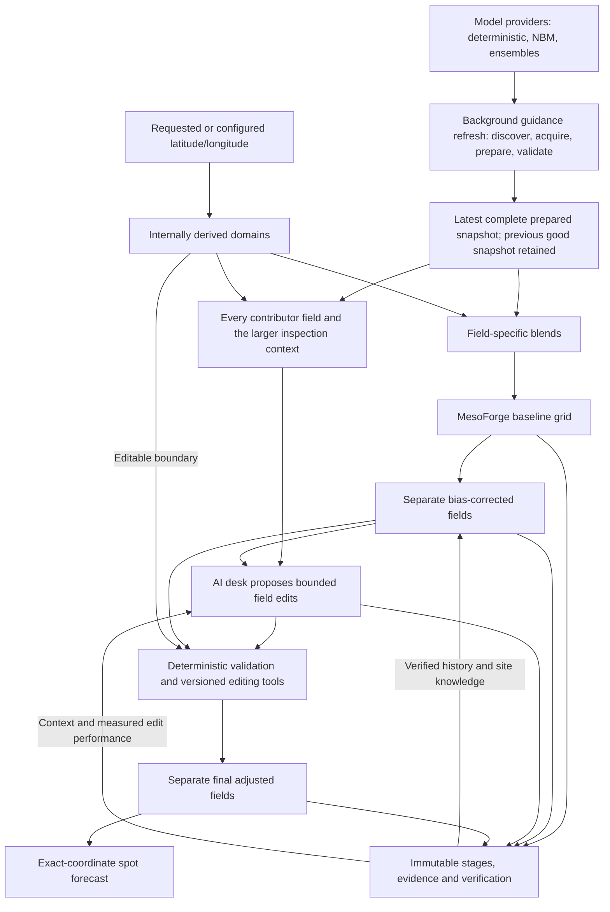

# MesoForge vision

MesoForge should become an automated local digital forecast system. A configured
latitude/longitude is the center of a local forecast domain, not just a point at
which model values are averaged. The system should build coherent weather fields,
learn from verification, and support bounded GFE-style forecast editing before
interpolating the delivered spot forecast at the exact requested coordinate.

The intended AI forecast desk works like a meteorologist using forecast-editing
tools: inspect a wider surrounding area, propose justified changes within a smaller
editable area, and let deterministic tools validate and apply those changes. The
original numerical baseline, statistical correction, AI proposal and final forecast
remain separately inspectable. Improvement must be measured, never assumed.

Human approvals govern development, policies and releases. Normal configured
forecast operation should not require a human to approve each forecast.

## North star: the blend is the forecast

This pipeline is the canonical long-term MesoForge architecture (owner direction,
2026-09-17). The rest of this document and the RFC are read against it:

```text
                     ┌─ HRRR
                     ├─ RAP
                     ├─ GFS
                     ├─ IFS
                     ├─ NBM
                     └─ ensembles
                         ↓
                FIELD-SPECIFIC BLENDS
                         ↓
                MesoForge baseline grid
                         ↓
               deterministic site learning
                         ↓
AI sees baseline + every contributor + surrounding context
                         ↓
       bounded spatial / temporal field edits
                         ↓
                final MesoForge grid
                         ↓
                  spot forecast
```

**The blend is the forecast.** MesoForge maintains one coherent baseline forecast
grid made from field-specific blends. Individual models are contributors, evidence,
provenance and context. They are not competing final forecasts presented to the user,
and no stage of the pipeline "picks a model."

### Field-specific blends

Every forecast field eventually gets its own scientifically appropriate blend
policy: temperature, dew point, wind, gust, cloud cover, visibility, QPF, PoP,
precipitation type, snowfall / SWE / SLR-derived snowfall, ice, thunder and later
fields. There is no universal set of model weights, because field types need
different mathematics:

- scalar fields use appropriate weighted numerical blending;
- winds blend vector components, never direction degrees;
- QPF keeps its interval/accumulation semantics;
- PoP combines and calibrates actual probabilistic guidance; it is not inferred from
  deterministic QPF;
- precipitation type should eventually use weighted support for rain, snow, freezing
  rain, sleet and mixed states, rather than requiring two particular deterministic
  models to agree;
- other specialized fields keep their own valid semantics.

A blend should eventually be able to vary by field, forecast lead, model
availability, age/freshness of the available guidance, verified historical model
skill, location/site performance and, later, weather regime. Freshness is one input,
not the decision: a newer run does not automatically dominate a better-performing
model. No equations or multipliers are defined here; they must come from
verification evidence through separately approved, versioned policies.

Today's fixed weights and source rules are **implementation scaffolding**, not this
philosophy: the fixed HRRR/GFS 70/30 temperature blend, the retained Phase 2
HRRR/GFS rows for dew point, wind, gust and QPF, the temporary NBM-only active
sources for hourly PoP, sky and thunder, the temporary HRRR/GFS agreement rule for
precipitation type, and RAP/IFS and other sources held as zero-weight
shadows/evidence. They remain in force until explicitly replaced.

### Contributors stay preserved

Each contributor's fields are retained beside the blend so later verification can
answer: what did the baseline say, what did each contributor say, what did
deterministic site correction change, what did the AI change, and did the AI improve
the forecast?

### The AI desk edits the blended grid

The future AI forecaster inspects the MesoForge baseline grid, every available
contributor field, model spread/disagreement, the larger context domain,
observations available before the decision cutoff, verification history, the
deterministic site/regime correction and structured site knowledge — like a
meteorologist cycling through model grids in GFE to understand how the blend reached
its answer. It reasons about the blended field and does **not** select one model as
"the forecast." If HRRR/RAP strongly support heavier QPF while GFS/IFS are much
lighter, the conclusion may be that the baseline is underdone in part of the editable
domain; the action is "move the MesoForge QPF field toward the stronger solution in
this region/time," never "use HRRR instead of GFS." The same holds for every field:
warm or cool a region, strengthen/weaken/rotate winds, adjust cloud extent,
increase/decrease/reshape QPF, modify PoP where probabilistic evidence supports it,
move rain/snow/freezing-rain boundaries, adjust snowfall/ice, smooth spatial or
temporal artifacts.

AI actions are persisted as bounded, interpretable edits to MesoForge's forecast
field (a delta over a region/time window, a spatial taper, temporal smoothing, a
shifted/retimed feature, an adjusted categorical transition boundary, a local
reshape), not as opaque global model-selection decisions. The explanation may cite
contributors as evidence; the stored modification remains a MesoForge field edit.
The AI can see more weather than it may modify, and the final point forecast is
derived from the final coherent field, never edited as an isolated point.

### Learning order

```text
native contributors
→ field-specific baseline blend
→ deterministic verified site/regime correction
→ AI forecast-desk adjustment
→ final grid
→ verification
```

Persistent statistical bias belongs to deterministic site learning first. The AI
must demonstrate value relative to the bias-corrected baseline and gets no credit
for rediscovering a simple mean bias.

### Guidance refresh is separate from forecast requests

Model acquisition/preparation and forecast generation should ultimately be
decoupled.

```text
BACKGROUND GUIDANCE REFRESH              AD-HOC FORECAST
new model cycles become available        lat/lon request
        ↓                                        ↓
discover / acquire / decode / prepare    use newest complete prepared snapshot
        ↓                                        ↓
validate completeness and provenance     construct/read local MesoForge baseline grid
        ↓                                        ↓
build/update shared prepared guidance    later: deterministic correction + AI desk
        ↓                                        ↓
publish an atomic `latest complete`      return forecast
prepared snapshot; keep the previous
good snapshot until its replacement
is complete
```

The refresh is slow and runs independently of any forecast request. An ad-hoc
forecast should not normally wait for GRIB downloads or the next clock-hour decision
window. For issued/scheduled forecasts, an external orchestrator such as GitHub
Actions decides **when** to invoke MesoForge; MesoForge owns **what** a forecast run
means. Model discovery, blending and weather science never live in workflow YAML.

Issuance time, source model cycles and source availability are separately recorded
facts. A forecast issued at 17:37 local time may validly use HRRR 18Z, RAP 21Z,
GFS 18Z and IFS 12Z if those are the newest complete eligible inputs; contributing
cycles are not required to match the issuance/reference hour. The provenance rule is
that every input used by an issued forecast was legitimately available before that
issuance's information cutoff.

### Today versus this north star

Implemented today: the local context/editable grid, real model acquisition,
current-cycle discovery, the active field policies and shadow/evidence contributors
listed above, immutable issuance, temperature verification, read-only site analysis,
deterministic conditions, transitions and period summaries. Still future: generalized
dynamic field-specific blending, data-driven model weighting, an operational
continuously refreshed prepared snapshot (a forward run still discovers, downloads
and prepares guidance inline before it can issue), applied deterministic site
corrections, AI/GFE spatial editing, and the final promotion/evaluation mechanisms.
This direction does not authorize implementing those stages inside unrelated work.

## What is established, and what is proposed

The implemented local V2 path produces a real **36-hour surface forecast** with
temperature, dew point, derived RH, vector wind speed/direction, gust and interval-aware
liquid precipitation and native NBM probability of precipitation. It discovers
current model cycles, prepares shared guidance, processes coordinate collections,
verifies eligible previous temperature forecasts and saves new immutable issuances.
HRRR/GFS remain active; temperature stays at 70/30 demonstration weights, while the
added fields use applicable retained Phase 2 rules. RAP and IFS are real zero-weight
shadows; IFS keeps native three-hourly gaps and has no compatible instantaneous gust.
Native NBM total sky cover is now the explicitly approved **temporary delivered
cloud baseline**. An optional attachment retains HRRR/GFS/RAP/IFS/NBM total cloud
cover across the same context/editable grid, with exact-point extraction. Percentages,
original units, products, cycles, native times and missingness remain traceable;
layer-specific and time-averaged clouds are not substituted for instantaneous total
cover. IFS retains its native three-hourly gaps. HRRR/GFS/RAP/IFS remain zero-weight
comparison evidence with descriptive disagreements; missing active NBM has no
substitute. The conditions preview may now derive sky from that active NBM field,
using the same existing categories and unrounded percentage. The categories are neither
opaque-sky observations nor complete weather-condition descriptions.
NBM-only cloud is an interim baseline, not the permanent enterprise architecture.
This decision enables useful deterministic sky conditions while the broader cloud
skill problem remains open. Future cloud blending/calibration must be selected
from suitable verification evidence, rather than copying temperature weights.

An optional native visibility attachment now retains HRRR/GFS/RAP/NBM instantaneous
horizontal surface visibility across that grid, using nearest native cells and
exact local-grid point extraction. Native metres, display miles, source definitions,
times, provenance and disagreement remain separate evidence. Visibility is absent
from the inspected official IFS open-data feed and stays explicitly unsupported.
There is no approved visibility blend: all sources have zero active weight and
delivered visibility remains unavailable. No arbitrary upper cap is imposed, and
missing native cells are not replaced by nearby values. Visibility alone never
determines fog, precipitation type/intensity or complete weather conditions.

An optional thunder attachment now retains native NBM hourly probability as the
user-approved temporary baseline, with separate three- and six-hour shadow events
across the same grid. Every value preserves its native event period and provenance;
unencoded physical thresholds and event footprints remain explicitly unknown. It is
not an exact-point lightning probability. Other inspected lightning/thunder products
remain distinct or unavailable until their native events and spatial support are
bound correctly. NBM-only thunder is not the final architecture: future multi-source
combination/calibration requires suitable verification evidence. Deterministic CAPE,
QPF, reflectivity or lightning diagnostics are not probabilities by themselves.

An optional native ice attachment retains NBM FRAM flat-ice mass-equivalent
accumulations separately from HRRR/RAP liquid-equivalent freezing rain across the
same grid. Exact intervals, native units, cumulative parents, provenance and
missingness remain traceable. All are zero-weight evidence; no approved active ice
blend or local accretion algorithm exists. Equal kg/m² units do not imply equal
physical meaning or ice thickness. Native flat ice, liquid freezing rain and a future
derived accretion estimate remain three separate concepts. A later method such as
FRAM needs validated thermodynamic, wind and precipitation inputs; no 1:1 conversion
or surface-temperature-only inference is adopted.

Shared prepared files hold native model grids. The local MesoForge surface baseline
uses one coordinate-derived grid covering a larger context domain, with a smaller
editable subset and an exact forecast-point target. The spot forecast is extracted
from its center node. QPF retains exact hourly accumulation bounds and approved
precipitation rows. PoP retains its native one-hour event (>0.01 inch liquid) and
approved NBM-only passthrough; it is not inferred from deterministic QPF.
NBM-only PoP is the current delivered baseline, not the intended final product.
The intended PoP is a measured, calibrated multi-source probabilistic forecast.
Native probability shadows now preserve source-specific thresholds, periods and
spatial support; only identical events can be compared. The initial bounded
experiment includes NBM/GEFS six-hour probabilities, REFS neighborhood heavy-rain
probabilities and ECMWF ensemble 24-hour probabilities. These are zero-weight
shadows, not interchangeable hourly probabilities or an approved final recipe.
Deterministic QPF may eventually be a predictor in calibration, but rainfall
amounts are not probabilities themselves. Final source weights and calibration
must come from verification evidence, not assumptions or this small demonstration.
The multi-source architecture is already implemented as bounded native-event
attachments; NBM-only describes active delivery, not an architectural restriction.
Matched NBM/GEFS six-hour events support descriptive comparison today. Their native
resolutions differ; calibration and observation verification still require a justified
spatial target. Incompatible REFS neighborhood and ECMWF daily/grid-box events stay
separate. No final weighting, calibration or automatic shadow collection is implemented.
An explicit preparation step now adds native precipitation-type evidence from
HRRR/GFS/RAP categorical flags, IFS native three-hourly categories and NBM
conditional type probabilities across the same context/editable grid. The temporary
baseline requires HRRR/GFS agreement; multiple supported types, disagreement,
unknown and unavailable states remain explicit. The other sources are separate
evidence, not categorical votes. No type is inferred from surface temperature,
QPF or PoP. This is not automatic forward-run acquisition or an evaluated final policy.
Long-term precipitation type, like PoP, should use multiple sources and verification;
neither the interim pair nor any single model is the permanent architecture.
Precipitation applicability is a separate future assessment from the native type
classification. Zero type flags do not establish a dry hour. Retained QPF/PoP intervals
and native type evidence allow a later rule to distinguish no meaningful precipitation
signal from precipitation with an unresolved type. No meaningful-signal threshold or
time reconciliation rule is approved yet; applicability is currently not assessed.
Neither PoP alone nor surface temperature should decide precipitation type.
An optional preparation step now retains native interval-aware snowfall water
equivalent from HRRR/RAP hourly accumulations and compatible IFS cumulative
endpoints. Native three-hour IFS increments remain three-hour amounts. All are
zero-weight evidence: there is no approved snowfall-water-equivalent blend rule,
so its active baseline remains explicitly unavailable. Snowpack water equivalent
and snowfall depth are not substitutes; QPF and precipitation type are not used to
manufacture snowfall amounts. Units, intervals, native parents and disagreement
remain traceable across the same context/editable grid and its exact point.
Another optional attachment now retains native **snowfall amount** (new snow depth
over an interval) from HRRR/RAP/NBM, separate NBM model SLR, and RAP Kuchera-derived
amounts using vertical air-temperature profiles and matching native SWE. All remain
zero-weight evidence with no approved active snowfall-amount blend. Native amounts,
native/model SLR and Kuchera retain their own provenance and definitions; NBM's
snow/sleet scope is not silently equated with snow-only estimates. Kuchera is the
first derived method, not unquestioned truth. Fixed 10:1 is not the preferred method
and is not used. Future snowfall methods and calibration must be chosen from suitable
verification evidence. The sampled profile and interval-end approximation remain
explicit limitations, with no derivation when required thermodynamic inputs are missing.
Snow depth (total snow already on the ground), ice amounts, deterministic bias correction,
site learning, AI editing, delivery and production deployment/scheduling
are not implemented.
The existing on-demand forward run and explicit batch history are not a deployed
registered-location service. [README.md](README.md) records commands, demonstrated
results and validation gaps; temperature remains the verified/scored field today.

The Python modular monolith, scientific contracts, provenance and PostgreSQL/S3
storage reuse accepted [architecture](docs/decisions/0001-python-modular-monolith.md)
and [storage](docs/decisions/0004-postgresql-and-s3-storage.md) decisions. The retained
Phase 2 station baseline supplies reused QPF science and the native NBM PoP event,
normalization and passthrough contract. NBM conditional type probabilities are now
retained separately as evidence; they do not change delivered PoP or Phase 2 defaults.

The owner-approved long-term direction below guides future design. The
[V2 RFC](docs/rfcs/mesoforge-v2-architecture.md) remains proposed where implementation
choices are unresolved. Completed, individually approved milestones do not approve
its entire release architecture. Unapproved release choices remain open.
Local Codex development continues; the Hermes pipeline remains paused.

## Intended coordinate-driven operation

Latitude/longitude are the only required geographic inputs. For example:

```json
{
  "locations": [
    {"lat": 44.98859, "lon": -93.25557, "name": "Minneapolis"},
    {"lat": 45.8, "lon": -93.1}
  ]
}
```

`name` is optional display metadata. New supported coordinates require no code
changes. MesoForge derives geographic details internally when needed: users do not
maintain bounding boxes, counties, model cells, domain corners, observation stations,
or surrounding zones. Available guidance and physical model domains still constrain
what can be forecast.

The intended spatial layers have different jobs:

| Layer | Purpose |
| --- | --- |
| Source guidance domain | Shared numerical-model data sufficient for interpolation and surrounding context; nearby locations reuse it instead of downloading or duplicating complete native datasets per location. |
| Context domain | The larger area the forecast desk may inspect for incoming systems, gradients, fronts, precipitation structures, freezing lines, surrounding observations and model disagreement. |
| Editable domain | A smaller bounded local region where approved tools may modify MesoForge forecast fields. Evidence outside it may inform edits inside it. |
| Forecast point | The exact configured latitude/longitude, where the final spot forecast is interpolated from the final local fields. |

Current preparation uses approved internal defaults of a **50 km minimum model-data
buffer**, **150 km surrounding context footprint**, and **50 km station search**.
These are preparation/search defaults, not an approved editable-domain radius or a
local forecast-grid design. Native-grid views are already shared across overlapping
locations and can be rebuilt from retained raw messages; distant locations may use
separate views of the same acquired guidance. Context ends at available model coverage.

The current surface grid uses one WGS84 azimuthal-equidistant lattice, with explicit
editable, context-only and forecast-point flags. Geometry parameters, extents and
masks are retained with source and transformation identities. Signed distance to the
editable boundary permits a future smooth taper; no taper or forecast adjustment is
applied. Measured geometry defaults are recorded in [README.md](README.md#local-surface-baseline-grid),
not permanent product constraints. Longer-term radii, resolution, projection, shape,
taper distances and storage layout remain open; dynamic weather-dependent sizing is
not implemented.

For explicitly configured/registered locations, the eventual lifecycle is:

1. Identify each coordinate, derive its domains and verify eligible prior issued
   versions using automatically selected suitable observations.
2. Use the newest complete prepared snapshot published by the background guidance
   refresh. Shared guidance is acquired, prepared and validated outside forecast
   requests, inspecting the collection so nearby locations share preparation.
3. Regrid and blend guidance with field-specific policies into coherent local
   MesoForge baseline fields, retaining every contributor's values, the applied
   weights, units, times, missingness and provenance.
4. Apply a deterministic site/regime bias correction derived from verified history,
   preserving both the original and bias-corrected baseline.
5. Let the AI desk inspect the baseline, every contributor, context, model
   disagreement, observations, prior verification and versioned site knowledge, then
   propose bounded spatial/temporal edits to the MesoForge fields, never a model
   selection.
6. Validate and apply accepted recipes through deterministic, versioned tools. Save
   the proposal, validation decisions and final adjusted fields separately.
7. Interpolate the final spot forecast at the exact coordinate; save the immutable
   issuance and its provenance, then deliver it when delivery is implemented.
8. As observations arrive, verify the original baseline, statistical correction and
   final adjustments on comparable samples, learning which behavior helps at that
   location and regime. Continue through every configured coordinate.

A location failure must not stop later locations. Unsuitable or missing observations
produce explicit unavailable verification and do not prevent a new forecast; no
learned correction or score is fabricated when history is absent. Station candidates
are already discovered/reused automatically, while time, distance and QC determine
which observation is an acceptable proxy for a forecast coordinate.

Ordinary one-off requests may receive a numerical point forecast without silently
becoming tracked locations. Explicitly configured/registered locations are where
persistent issuance, verification, site knowledge, bias correction, AI desk behavior
and delivery can accumulate. Today the registration is the forward run's coordinate
list (`lat`, `lon`, optional `name`, optional presentation `display_timezone`).
Repeated forward runs accumulate immutable issued versions and verification facts
for those coordinates, a read-only accumulation status reports how much
verified history exists per coordinate and lead range, and a read-only verification
analysis describes temperature error from canonical samples (stored facts are
evidence, not automatically samples) while reporting insufficient evidence for any
correction. Accumulating that history is
the learning loop's data source; it is not yet learning: no weights, bias
corrections or regime labels are derived from it, and the complete future lifecycle
(site knowledge, corrections, AI desk, delivery) is not implemented.

The intended deployment keeps the API and persistent forecast data on a VPS. A future
GitHub Actions caller or scheduler may process the coordinate list sequentially or
in bounded batches by invoking the same forward-run command, which is already safe
to repeat: an overlapping run is refused by a storage-level lock and a repeated run
skips coordinates that already hold a version for the discovered decision window.
The orchestrator decides only when MesoForge runs; discovery, blending and every
other scientific rule stay inside MesoForge. That deployment and scheduling remain
deferred; preparation must stay outside forecast HTTP requests regardless of how
runs are started. Today the forward run itself still performs discovery, acquisition
and preparation before issuing (roughly 11–13 minutes in the local demonstrations,
and it must finish within the reference UTC hour); moving that work into a
background refresh that publishes a latest complete prepared snapshot is future
work, described in the [north star](#guidance-refresh-is-separate-from-forecast-requests).

## Long-term model direction

The owner-approved direction is an enterprise-style multi-model blend: HRRR, RAP,
NAM 3 km (NAM CONUS nest), NAM, GFS, RRFS / REFS, and NBM, with useful deterministic
and ensemble guidance such as GEFS, ECMWF and Canadian models where appropriate.
Availability, access and scientific suitability determine useful integrations; this
is not a requirement to acquire every model simultaneously. HRRR/GFS active guidance
and RAP/ECMWF IFS shadows are implemented in the V2 surface path. Retained Phase 2
also supports NBM. Temperature's 70/30 demonstration is not an optimized or universal
field-weight policy. These models are contributors to
[field-specific blends](#field-specific-blends), not alternative forecasts: adding a
model adds evidence and a possible blend member for the fields it supports well.

Common model capabilities and named/versioned scalar recipes support arbitrary
contributor lists. Adapters own model-specific acquisition, normalization, native-grid,
lead and availability semantics; registration alone cannot supply those capabilities.
The lifecycle remains **shadow → evaluated → active → deprecated → retired**.
Shadow values/provenance use the same immutable issuance and comparison infrastructure,
without affecting the active control. Evaluation supplies evidence, not automatic
approval. Promotion requires an approved versioned configuration; retirement preserves
historical identities and issued records. Family/lineage metadata prepares for later
diversity-aware evaluation, not an implemented weighting algorithm.

NAM and NAM 3 km are transition/legacy candidates, not permanent dependencies.
Verified on 2026-09-10: NWS [SCN 26-47, updated September 9](https://www.weather.gov/media/notification/pdf_2026/SCN26-47_Updated_Retire_NAM_SREF_HREF_HiresW_NAM_MOS.aab.pdf)
announces retirement of NAM 12 km and its nests, along with SREF, HREF, HiresW,
and NAM MOS, on **October 14, 2026 at 12:00 UTC**. The companion
[SCN 26-48, updated September 9](https://www.weather.gov/media/notification/pdf_2026/scn26-048_Updated_RRFS_and_REFS_Implementation_aad.pdf)
describes their RRFS/REFS replacement path. The coordinated date can be delayed
by critical/significant weather. Earlier August 31 and October 6 dates are superseded;
recheck official notices before implementing a NAM integration or transition.

Retain the raw model files/messages actually acquired, including fields not yet
used in a product, with indexes and source metadata. Shared prepared subsets and
local forecast fields do not replace that source evidence. Future trimming and
retention periods are separate decisions; this does not authorize downloading every
field, level, lead or model, or guarantee indefinite retention.

## Proposed architecture

The diagram shows the intended forecast-domain workflow, not functionality already
running. It is the [north-star pipeline](#north-star-the-blend-is-the-forecast) with
its storage and evidence paths. Shared source guidance and the local MesoForge
forecast field are distinct, and the background refresh is separate from any
forecast request:



These are responsibilities in the existing application architecture, not mandated
microservices or another persistence framework. Large immutable field artifacts and
their lineage should reuse the PostgreSQL/S3 path; their packaging remains to be
measured. Multiple local forecasts can reference one shared source snapshot without
copying complete native datasets for each configured location. Slow acquisition,
decoding and preparation belong to the background refresh; a forecast request
consumes the newest complete snapshot and never triggers downloads. Regridding,
blending and editing of local fields occur outside the normal HTTP request path
until measurement shows a bounded request can afford them.

## Proposed first usable release

The release direction remains a private operator-controlled forecast service with
useful deterministic output, immutable configured-location history, suitable
observation matching and bounded performance queries. The implemented local surface
grid establishes the numerical representation across context and editable domains.
Native precipitation-type evidence now uses this same grid. The bounded ECMWF
six-hour probability assessment remains explicitly incompatible rather than converting
a daily product or ignoring incompatible spatial support. Native snowfall water
equivalent is now retained as unblended evidence on the same grid. Native interval
snowfall amounts, native model SLR and first profile-based Kuchera estimates are also
separate evidence. Snow depth on the ground is not newly accumulated snowfall.
Native total-cloud, visibility and thunder-probability evidence are now available
on the same grid, together with native flat-ice and freezing-rain liquid evidence.
The [forecast-canvas inventory and condition-layer design](docs/rfcs/mesoforge-v2-architecture.md#67-forecast-canvas-and-deterministic-conditions)
now distinguish delivered fields from native evidence and unresolved active policies.
The implemented read-only preview from one exact saved forecast shows
numeric precipitation probability and amount with their own intervals, and native
p-type as a separate endpoint state, plus sky from the temporary active NBM field.
It does not imply a type-specific interval probability or promote shadow cloud,
visibility or winter-amount evidence. Explicit wording thresholds and precedence
for precipitation, wind and thunder are the next policy gap. Complete derived
conditions remain future work. Low visibility alone cannot establish fog,
precipitation or another cause.
Native snowfall, NBM SLR and Kuchera remain
separately traceable until sufficient suitable verification exists; a broad snowfall/SLR
campaign is deferred. No constant ratio, native single-source rule or derived method
is assumed to be best; zero/missing water denominators cannot establish an observed SLR.
Locally derived ice accretion requires suitable additional guidance and validated
meteorological inputs; statistical correction, AI, delivery and learning are not prerequisites.

The exact wider release support matrix, authentication, measured resource limits,
local-grid design and retention promises remain open. Existing approved field and
model rules remain in force until explicitly changed; the long-term north star
does not authorize implementing the roadmap as one task.

## Future roadmap

Fields should grow from today's surface, QPF, PoP, native type, SWE, native/derived
snowfall-amount, cloud, visibility, native thunder and distinct ice/freezing-rain
evidence to other useful forecasts as separately approved. Snow depth on the
ground and locally derived accretion remain future work. Conditions should first be
structured sky, precipitation, thunder, visibility/cause, wind and transition
components, then deterministic text from a versioned renderer. They must preserve
each component's time/event meaning, evidence and distinct unknown, ambiguous,
unavailable and not-applicable states. No field is promoted just to complete a phrase.
Future accepted AI field edits would produce a separately identified field stage;
the condition rules would still derive the final text from those saved fields.

Future AI tools may apply a regional/time-window delta, taper changes spatially or
temporally, anchor a value and blend around it, smooth an artifact, shift or retime
a precipitation feature, adjust a freezing line/rain-snow transition, or remove
unsupported isolated trace-QPF noise. Coherent edits must preserve continuity at
the boundary. Each is an edit to MesoForge's own field; contributor models may be
cited as the evidence for it, but "replace the blend with model X" is not an edit
type. These are examples to design and evaluate, not implemented operations
or permission for arbitrary grid writes. Deterministic validation must enforce
physical consistency, bounds, continuity, information cutoffs, editable-domain limits
and applicable cross-field relationships before any proposed change is accepted.

Learning has three distinct meanings, all future work:

| Kind | Meaning and evidence |
| --- | --- |
| Statistical learning | Deterministic site/regime bias correction derived from verified history, with retained training inputs, code and versioned correction parameters. |
| Site knowledge | Structured, versioned, inspectable knowledge of recurring local behavior and regimes, tied to supporting evidence; it does not assume an LLM permanently remembers previous runs. |
| AI performance learning | Measure which edit types improve forecasts, and under which regimes, using identical eligible forecast/observation samples and explicit sample counts. |

Evaluate the AI's added value against the **bias-corrected baseline**, while retaining
the original numerical baseline as a separate comparison. AI must not receive credit
for corrections that ordinary statistical methods can make. Missing evidence remains
missing; neither tiny demonstrations nor unmatched samples establish forecast skill.

Two owner-approved policies govern that learning (details in the
[RFC](docs/rfcs/mesoforge-v2-architecture.md)):

- **Decision window** (`mesoforge-decision-window-policy.v1`): the first successful
  eligible issuance for a scheduled decision window is the canonical operational
  forecast. An identical reissue is preserved and collapses analytically; a materially
  different reissue is preserved as an alternate and never silently replaces the
  primary. Older versions whose operational role cannot be determined stay ambiguous,
  and immutable history is never rewritten. Scheduled runs will eventually carry an
  explicit `decision_window_id` and primary/reissue role.
- **Evidence before correction** (`mesoforge-bias-evidence-policy.v1`): a deterministic
  temperature-bias correction may be *proposed* only per lead bucket (1–6, 7–18,
  19–36 h), from at least 30 canonical verified samples on at least 10 distinct
  decision dates, spanning several forecast episodes rather than one weather event,
  with the uncertainty of the mean bias reported and no proposal from sparse,
  concentrated or inconsistent evidence. These are initial governance thresholds, not
  claims of statistical sufficiency.

A satisfied evidence policy never activates a correction. The lifecycle is: verified
historical evidence → deterministic candidate correction → shadow correction on future
forecasts → identical-sample verification against the unchanged baseline → human,
versioned promotion only if improvement is demonstrated, judged on at least MAE and
RMSE rather than mean bias alone. History at the policy checkpoint (65 Minneapolis
samples from one roughly 19-hour episode and one station) was `insufficient_evidence`;
the 2026-09-17 demonstration run (85 samples, still two decision dates and one
station) remains so.

## Essential boundaries

- Numerical fields and deterministic edits must be reproducible for fixed retained
  inputs, grid definition, code, parameters and configuration. AI proposals need not
  regenerate identically: preserve the actual proposal/edit recipe, validation outcome,
  accepted operations and stage identities to replay its deterministic application.
- The delivered forecast is the MesoForge field-specific blend and its later stages,
  never a single selected model. Preserve every contributor's fields beside the
  blend, and the original baseline, bias-corrected fields, AI proposal/edit recipe and
  final adjusted fields separately. A refresh creates a new immutable issuance;
  verification compares exact issued versions/stages and observation revisions,
  never replacements.
- Keep coordinates distinct from observation proxies. Score only suitable spatial and
  temporal support and report why an observation or field is unscored.
- Preserve units, source/native-grid semantics, wind vectors, valid/interval times,
  explicit missingness, exclusions and approved field-specific weights. No silent
  clamping, invented probabilities, confidence, samples or learned skill.
- Enforce the applicable approved information cutoff at every stage. The existing
  current-model-set evidence proves provider availability at decision time and records
  later acquisition/issuance separately; the RFC's broader ingestion-cutoff design is
  still proposed. Future corrections, site knowledge and AI context must retain their
  own evidence cutoffs and cannot use future information. Contributing model cycles
  need not match the issuance/reference hour: the rule is that every input was
  legitimately available before that issuance's information cutoff, with issuance
  time, source cycles and source availability recorded as separate facts.
- No downloads, regional decoding/regridding, training or AI inside a normal forecast
  HTTP request. Slow guidance preparation should not ultimately live inside an
  ordinary forecast request of any kind. An external scheduler decides when MesoForge
  runs, never what a run means. A one-off request does not silently acquire
  persistent tracking/history.
- Reuse scientific functions where contracts fit. Retain raw guidance, transformation
  definitions/results, stage artifacts and lineage only with accurately stated replay
  capabilities; no promise exceeds retained inputs and compatible dependencies.
- Historical Phase 3 plans and donor branches remain references, not the product
  architecture or instructions to resume Hermes. Future stages require scoped approval.
