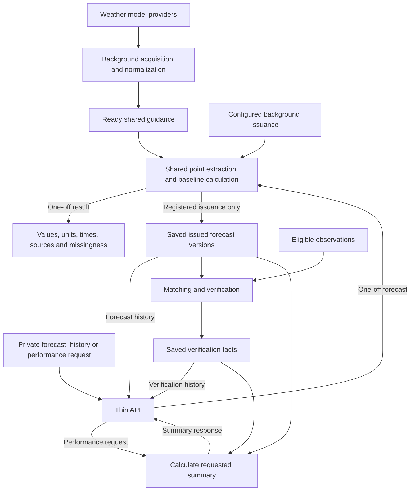

# MesoForge vision

MesoForge is intended to be an automatically updating, location-aware weather
forecasting engine exposed through an API. It reuses numerical model guidance to
produce forecasts for supported coordinates, preserves issued forecasts for registered
locations, and measures their performance against suitable observations. Later learning
and bounded AI adjustments must demonstrate value; improvement is not assumed or guaranteed.

Human approvals govern development and releases. Normal configured forecast operation
should not require a human to approve each forecast.

## What is established, and what is proposed

The existing Phase 0–2 implementation provides a Python modular monolith, versioned
scientific contracts, immutable artifacts with provenance, PostgreSQL metadata,
S3-compatible storage, and a deterministic HRRR/NBM/GFS station baseline with METAR
verification. These foundations have accepted [architecture](docs/decisions/0001-python-modular-monolith.md)
and [storage](docs/decisions/0004-postgresql-and-s3-storage.md) decisions. See
[README.md](README.md) for the actual capability and execution limits.

The owner has moved development to local Codex and paused the Hermes development
pipeline. The [revised V2 RFC](docs/rfcs/mesoforge-v2-architecture.md) is the proposed
direction for a selective rebuild using suitable existing scientific functions.
It remains **Proposed for owner architecture review**. This document does not approve
its design choices, its full release scope, or the suggested first API milestone.

## Proposed architecture

Acquire and cache required guidance in the background, and reuse it across locations.
Retries and provider revisions must not create duplicate logical results.
The diagram describes the proposed release, not services already running:

Boxes represent responsibilities within one application codebase, not mandatory
microservices, classes, or separate frameworks. API requests and background issuance
reuse the same forecast calculations.

The proposed implementation keeps scientific logic separate from HTTP, workers, and
storage. Acquisition and heavy preparation run outside the forecast request path,
not as heavy work attached to an HTTP response. An HTTP request performs only bounded
reads and calculation. This does not require a new broker or scheduling framework.
One-off requests do not silently register a location or create durable forecast history.

## Proposed first usable release

- A private, operator-controlled API for a bounded supported region.
- Deterministic forecasts at supported coordinates from prepared shared guidance.
- Immutable forecast history for registered locations.
- Observation acquisition, deterministic matching, and verification history.
- Basic bounded performance queries over normalized facts.

This is a release direction, not one implementation task. The immediate suggested
increment is much smaller: a coordinate forecast from prepared guidance, exposing
values, units, source cycles, valid times, and missingness. The exact support matrix,
weights/fallbacks, preparation format, and private-access boundary are not yet approved.

## Future roadmap

Measured bias correction and learned model weights may later improve the baseline.
Structured AI proposals may follow, with deterministic validation and bounds.
Email/delivery, public accounts, broader geography/model coverage, and additional
products are later work. None is needed to implement the first small baseline slice,
and none expands an active task without a separate request.

## Essential boundaries

- The numerical baseline is deterministic for fixed inputs and configuration. Any
  later accepted AI adjustment is stored separately and remains traceable to that
  baseline. AI cannot publish unchecked numerical changes. Do not invent learned
  skill or confidence.
- Refreshing a location creates a new forecast version. Verification compares
  observations with the version originally issued, not a newer replacement.
- Keep forecast coordinates separate from observation stations. Score a field only
  when the selected observation has suitable spatial support and matching time/interval
  semantics; otherwise report why it is unscored.
- Keep units, wind conventions, source/valid/interval times, and missingness explicit.
  Preserve source provenance and configuration; missing is not zero.
- Respect information cutoffs. The V2 proposal requires both provider availability
  and local ingestion to meet the cutoff; an event timestamp alone is insufficient.
- No provider downloads, regional decoding, or training inside a forecast HTTP request.
- Retain original source evidence and advertise only replay capabilities supported
  by retained data and compatible execution dependencies.
- Reuse suitable science without importing obsolete Phase 3 singleton/lattice/proof
  machinery as the product architecture. Preserve donors as historical references.

The RFC leaves owner decisions open on supported region/model/field/horizon combinations,
weights and policies, private authentication, host reserve and measured work limits,
cache packaging, and retention promises. FastAPI, PostgreSQL jobs, spatial partition
packaging, and an envelope of up to 36 horizons are proposed choices, not completed
features or blanket approvals. A small approved milestone need not settle unrelated
later-release decisions.
