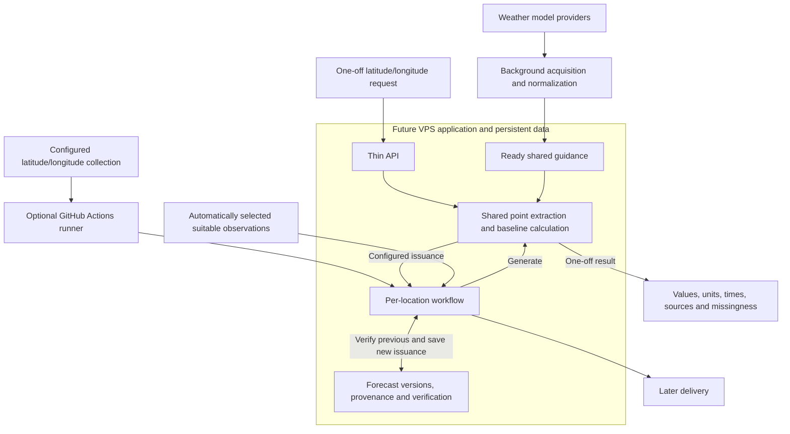

# MesoForge vision

MesoForge is intended to be an automatically updating, location-aware weather
forecasting engine exposed through an API. It reuses numerical model guidance to
produce forecasts for supported coordinates, preserves issued forecasts for registered
locations, and measures their performance against suitable observations. Later learning
and bounded AI adjustments must demonstrate value; improvement is not assumed or guaranteed.

Human approvals govern development and releases. Normal configured forecast operation
should not require a human to approve each forecast.

## What is established, and what is proposed

The existing Phase 0–2 implementation provides a Python modular monolith, versioned
scientific contracts, immutable artifacts with provenance, PostgreSQL metadata,
S3-compatible storage, and a deterministic HRRR/NBM/GFS station baseline with METAR
verification. These foundations have accepted [architecture](docs/decisions/0001-python-modular-monolith.md)
and [storage](docs/decisions/0004-postgresql-and-s3-storage.md) decisions. See
[README.md](README.md) for the actual capability and execution limits.

The owner has moved development to local Codex and paused the Hermes development
pipeline. The [revised V2 RFC](docs/rfcs/mesoforge-v2-architecture.md) is the proposed
direction for a selective rebuild using suitable existing scientific functions.
Its full release architecture remains **Proposed for owner architecture review**.
The owner separately approved the small localhost HRRR/GFS temperature endpoint
and fixed real prepared guidance, now extended to hours 1–36. That slice now works;
its observed results and validation gaps are recorded in README.
That approval does not authorize the entire release or the model roadmap below.

## Intended coordinate-driven operation

The owner-approved operating direction below is **future functionality**, not a
description of the current localhost demonstration or approval to implement every
stage together. The user-facing geographic input should ultimately be only
latitude/longitude. A configurable collection should look conceptually like:

```json
{
  "locations": [
    {"lat": 45.8, "lon": -93.1},
    {"lat": 44.98, "lon": -93.27}
  ]
}
```

The local batch command now accepts this configuration shape with one existing
36-hour prepared dataset; the second coordinate is outside its supported area
and produces a location error. The operating lifecycle below remains future work.
Adding supported coordinates should require configuration changes, not code changes.
Users should not maintain observation stations, bounding boxes, surrounding counties,
model grid coordinates, or spatial zones. MesoForge should identify the location
and derive any needed geographic metadata and surrounding weather context internally.
The service's supported coverage and scientific suitability rules remain explicit.

The API and persistent forecast data should run on a VPS. Model acquisition and
preparation remain separate from forecast HTTP requests; prepared guidance is shared
across nearby coordinates rather than downloaded again for each location. A GitHub
Actions workflow can read the coordinate collection and process it one location at
a time or in bounded batches, using the VPS application and its persistent data.

For each explicitly configured location, the intended sequence is:

1. Identify the location from its coordinates.
2. Verify eligible previously issued forecasts when suitable observations are available.
3. Generate the new deterministic numerical forecast from prepared guidance.
4. Later, allow a bounded AI adjustment/discussion stage using that numerical forecast,
   internally derived surrounding weather context, and prior verification.
5. Save the issued forecast and provenance, keeping any accepted adjustment separate
   from its numerical baseline.
6. Deliver the issued forecast, then continue to the next coordinate.

Failure for one location must not prevent processing the remaining locations.
Observation sources/proxies should be selected automatically under suitability rules
and recorded with the verification. When none is suitable, verification remains
explicitly unavailable and the next forecast can still proceed. A normal one-off API
request must not silently register or track its coordinate. AI and delivery remain
later stages; GitHub Actions, registration, and this lifecycle are not implemented
by documenting this direction.

## Long-term model direction

The owner-approved direction is an enterprise-style multi-model blend: HRRR, RAP,
NAM 3 km (NAM CONUS nest), NAM, GFS, RRFS / REFS, and NBM, with additional useful
deterministic and ensemble guidance such as GEFS, ECMWF, and Canadian models where
appropriate. Product availability, access, and scientific suitability determine
which integrations are useful. This is planned coverage, not implemented support
or a requirement to acquire every model simultaneously. The current Phase 2 path
supports HRRR/NBM/GFS; the small coordinate endpoint uses HRRR/GFS temperature only.
The 70/30 demonstration weights are not a policy for the eventual model blend.

NAM and NAM 3 km are transition/legacy candidates, not permanent dependencies.
Verified on 2026-09-10: NWS [SCN 26-47, updated September 9](https://www.weather.gov/media/notification/pdf_2026/SCN26-47_Updated_Retire_NAM_SREF_HREF_HiresW_NAM_MOS.aab.pdf)
announces retirement of NAM 12 km and its nests, along with SREF, HREF, HiresW,
and NAM MOS, on **October 14, 2026 at 12:00 UTC**. The companion
[SCN 26-48, updated September 9](https://www.weather.gov/media/notification/pdf_2026/scn26-048_Updated_RRFS_and_REFS_Implementation_aad.pdf)
describes their RRFS/REFS replacement path. The coordinated date can be delayed
by critical/significant weather. Earlier August 31 and October 6 dates are superseded;
recheck official notices before implementing a NAM integration or transition.

Retain the original raw model files/messages actually acquired, including fields
not yet used by the API; prepared subsets do not replace that source evidence.
Later trimming of fields/products is a separate decision. This does not authorize
downloads of every field, level, lead, or model, or promise indefinite retention.
The current test acquires only selected temperature messages and retains them in
full, together with their indexes and source metadata, outside Git.

## Proposed architecture

Acquire and cache required guidance in the background, and reuse it across locations.
Retries and provider revisions must not create duplicate logical results.
The diagram describes the intended operating model, not services already running:



Boxes represent responsibilities within one application codebase, not mandatory
microservices, classes, or separate frameworks. API requests and background issuance
reuse the same forecast calculations.

The proposed implementation keeps scientific logic separate from HTTP, workers, and
storage. Acquisition and heavy preparation run outside the forecast request path,
not as heavy work attached to an HTTP response. An HTTP request performs only bounded
reads and calculation. This does not require a new broker or scheduling framework.
One-off requests do not silently register a location or create durable forecast history.

## Proposed first usable release

- A private, operator-controlled API for a bounded supported region.
- Deterministic forecasts at supported coordinates from prepared shared guidance.
- Immutable forecast history for registered locations.
- Observation acquisition, deterministic matching, and verification history.
- Basic bounded performance queries over normalized facts.

This is a release direction, not one implementation task. The completed first
demonstration is much smaller: a coordinate temperature forecast from prepared
guidance, exposing values, units, source cycles, valid times, and missingness.
The exact support matrix,
weights/fallbacks, preparation format, and private-access boundary for the full
release remain open. The separately approved temperature slice keeps its existing
area, hours 1–36, localhost binding, and fixed 70/30 demonstration weights.

## Future roadmap

Measured bias correction and learned model weights may later improve the baseline.
Structured AI proposals may follow, with deterministic validation and bounds.
Email/delivery, public accounts, broader geography/model coverage, and additional
products are later work. None is needed to implement the first small baseline slice,
and none expands an active task without a separate request.

## Essential boundaries

- The numerical baseline is deterministic for fixed inputs and configuration. Any
  later accepted AI adjustment is stored separately and remains traceable to that
  baseline. AI cannot publish unchecked numerical changes. Do not invent learned
  skill or confidence.
- Refreshing a location creates a new forecast version. Verification compares
  observations with the version originally issued, not a newer replacement.
- Keep forecast coordinates separate from observation stations. Score a field only
  when the selected observation has suitable spatial support and matching time/interval
  semantics; otherwise report why it is unscored.
- Keep units, wind conventions, source/valid/interval times, and missingness explicit.
  Preserve source provenance and configuration; missing is not zero.
- Respect information cutoffs. The V2 proposal requires both provider availability
  and local ingestion to meet the cutoff; an event timestamp alone is insufficient.
- No provider downloads, regional decoding, or training inside a forecast HTTP request.
- Retain original source evidence and advertise only replay capabilities supported
  by retained data and compatible execution dependencies.
- Reuse suitable science without importing obsolete Phase 3 singleton/lattice/proof
  machinery as the product architecture. Preserve donors as historical references.

The RFC leaves owner decisions open on supported region/model/field/horizon combinations,
weights and policies, private authentication, host reserve and measured work limits,
cache packaging, and retention promises. FastAPI, PostgreSQL jobs, spatial partition
packaging, and broader field/model coverage across 36 horizons are proposed choices,
not completed features or blanket approvals. The small approved temperature slice
does not settle unrelated
later-release decisions.
