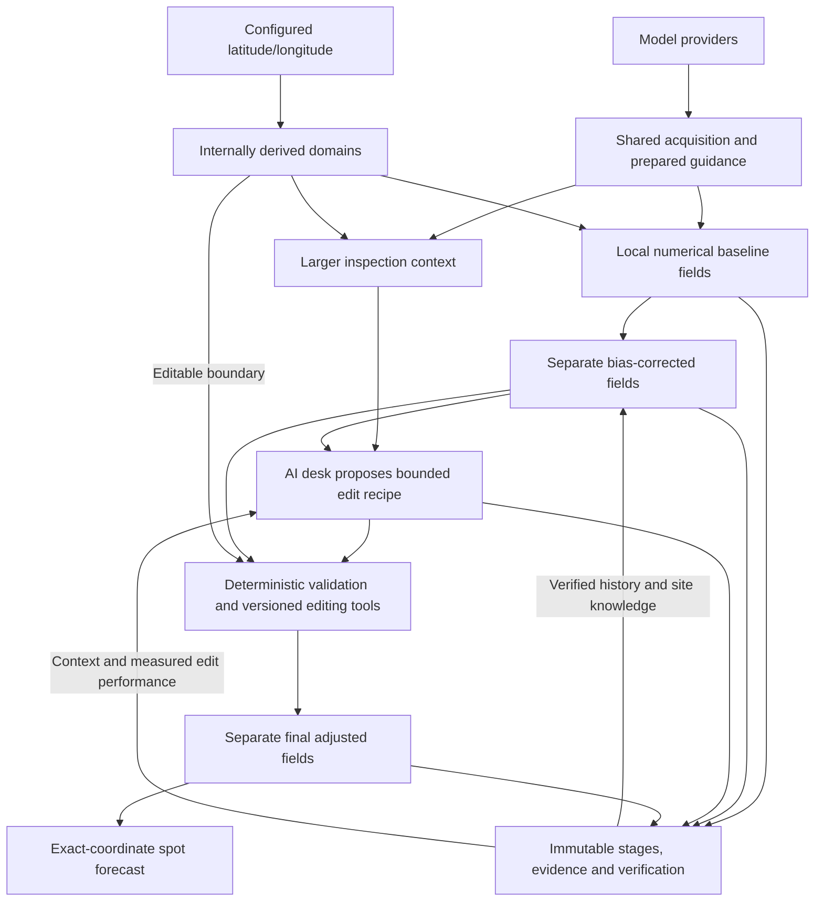

# MesoForge vision

MesoForge should become an automated local digital forecast system. A configured
latitude/longitude is the center of a local forecast domain, not just a point at
which model values are averaged. The system should build coherent weather fields,
learn from verification, and support bounded GFE-style forecast editing before
interpolating the delivered spot forecast at the exact requested coordinate.

The intended AI forecast desk works like a meteorologist using forecast-editing
tools: inspect a wider surrounding area, propose justified changes within a smaller
editable area, and let deterministic tools validate and apply those changes. The
original numerical baseline, statistical correction, AI proposal and final forecast
remain separately inspectable. Improvement must be measured, never assumed.

Human approvals govern development, policies and releases. Normal configured
forecast operation should not require a human to approve each forecast.

## What is established, and what is proposed

The implemented local V2 path produces a real **36-hour surface forecast** with
temperature, dew point, derived RH, vector wind speed/direction, gust and interval-aware
liquid precipitation. It discovers
current model cycles, prepares shared guidance, processes coordinate collections,
verifies eligible previous temperature forecasts and saves new immutable issuances.
HRRR/GFS remain active; temperature stays at 70/30 demonstration weights, while the
added fields use applicable retained Phase 2 rules. RAP and IFS are real zero-weight
shadows; IFS keeps native three-hourly gaps and has no compatible instantaneous gust.
Cloud cover is explicitly unavailable without an approved blend policy.

Shared prepared files hold native model grids. The local MesoForge surface baseline
uses one coordinate-derived grid covering a larger context domain, with a smaller
editable subset and an exact forecast-point target. The spot forecast is extracted
from its center node. QPF retains exact hourly accumulation bounds and approved
precipitation rows. PoP, precipitation type, snowfall, deterministic bias correction,
site learning, AI editing, delivery and production deployment/scheduling
are not implemented.
The existing on-demand forward run and explicit batch history are not a deployed
registered-location service. [README.md](README.md) records commands, demonstrated
results and validation gaps; temperature remains the verified/scored field today.

The Python modular monolith, scientific contracts, provenance and PostgreSQL/S3
storage reuse accepted [architecture](docs/decisions/0001-python-modular-monolith.md)
and [storage](docs/decisions/0004-postgresql-and-s3-storage.md) decisions. The retained
Phase 2 station baseline supplies reused QPF science. Its retained PoP support is a
technical starting point for a later probabilistic field, not implemented V2 PoP.

The owner-approved long-term direction below guides future design. The
[V2 RFC](docs/rfcs/mesoforge-v2-architecture.md) remains proposed where implementation
choices are unresolved. Completed, individually approved milestones do not approve
its entire release architecture. This documentation change implements no new behavior.
Local Codex development continues; the Hermes pipeline remains paused.

## Intended coordinate-driven operation

Latitude/longitude are the only required geographic inputs. For example:

```json
{
  "locations": [
    {"lat": 44.98859, "lon": -93.25557, "name": "Minneapolis"},
    {"lat": 45.8, "lon": -93.1}
  ]
}
```

`name` is optional display metadata. New supported coordinates require no code
changes. MesoForge derives geographic details internally when needed: users do not
maintain bounding boxes, counties, model cells, domain corners, observation stations,
or surrounding zones. Available guidance and physical model domains still constrain
what can be forecast.

The intended spatial layers have different jobs:

| Layer | Purpose |
| --- | --- |
| Source guidance domain | Shared numerical-model data sufficient for interpolation and surrounding context; nearby locations reuse it instead of downloading or duplicating complete native datasets per location. |
| Context domain | The larger area the forecast desk may inspect for incoming systems, gradients, fronts, precipitation structures, freezing lines, surrounding observations and model disagreement. |
| Editable domain | A smaller bounded local region where approved tools may modify MesoForge forecast fields. Evidence outside it may inform edits inside it. |
| Forecast point | The exact configured latitude/longitude, where the final spot forecast is interpolated from the final local fields. |

Current preparation uses approved internal defaults of a **50 km minimum model-data
buffer**, **150 km surrounding context footprint**, and **50 km station search**.
These are preparation/search defaults, not an approved editable-domain radius or a
local forecast-grid design. Native-grid views are already shared across overlapping
locations and can be rebuilt from retained raw messages; distant locations may use
separate views of the same acquired guidance. Context ends at available model coverage.

The current surface grid uses one WGS84 azimuthal-equidistant lattice, with explicit
editable, context-only and forecast-point flags. Geometry parameters, extents and
masks are retained with source and transformation identities. Signed distance to the
editable boundary permits a future smooth taper; no taper or forecast adjustment is
applied. Measured geometry defaults are recorded in [README.md](README.md#local-surface-baseline-grid),
not permanent product constraints. Longer-term radii, resolution, projection, shape,
taper distances and storage layout remain open; dynamic weather-dependent sizing is
not implemented.

For explicitly configured/registered locations, the eventual lifecycle is:

1. Identify each coordinate, derive its domains and verify eligible prior issued
   versions using automatically selected suitable observations.
2. Acquire/retain required shared guidance outside forecast HTTP requests, inspecting
   the collection first so nearby locations share preparation.
3. Regrid/blend guidance into coherent local MesoForge baseline fields, retaining
   contributor values, weights, units, times, missingness and provenance.
4. Apply a deterministic site/regime bias correction derived from verified history,
   preserving both the original and bias-corrected baseline.
5. Let the AI desk inspect context, model disagreement, observations, prior verification
   and versioned site knowledge, then propose bounded spatial/temporal edit recipes.
6. Validate and apply accepted recipes through deterministic, versioned tools. Save
   the proposal, validation decisions and final adjusted fields separately.
7. Interpolate the final spot forecast at the exact coordinate; save the immutable
   issuance and its provenance, then deliver it when delivery is implemented.
8. As observations arrive, verify the original baseline, statistical correction and
   final adjustments on comparable samples, learning which behavior helps at that
   location and regime. Continue through every configured coordinate.

A location failure must not stop later locations. Unsuitable or missing observations
produce explicit unavailable verification and do not prevent a new forecast; no
learned correction or score is fabricated when history is absent. Station candidates
are already discovered/reused automatically, while time, distance and QC determine
which observation is an acceptable proxy for a forecast coordinate.

Ordinary one-off requests may receive a numerical point forecast without silently
becoming tracked locations. Explicitly configured/registered locations are where
persistent issuance, verification, site knowledge, bias correction, AI desk behavior
and delivery can accumulate. Current explicit batch runs already preserve history;
registration and the complete future lifecycle are not yet implemented.

The intended deployment keeps the API and persistent forecast data on a VPS. A future
GitHub Actions caller or scheduler may process the coordinate list sequentially or
in bounded batches. That deployment and scheduling remain deferred; preparation must
stay outside forecast HTTP requests regardless of how runs are started.

## Long-term model direction

The owner-approved direction is an enterprise-style multi-model blend: HRRR, RAP,
NAM 3 km (NAM CONUS nest), NAM, GFS, RRFS / REFS, and NBM, with useful deterministic
and ensemble guidance such as GEFS, ECMWF and Canadian models where appropriate.
Availability, access and scientific suitability determine useful integrations; this
is not a requirement to acquire every model simultaneously. HRRR/GFS active guidance
and RAP/ECMWF IFS shadows are implemented in the V2 surface path. Retained Phase 2
also supports NBM. Temperature's 70/30 demonstration is not an optimized or universal
field-weight policy.

Common model capabilities and named/versioned scalar recipes support arbitrary
contributor lists. Adapters own model-specific acquisition, normalization, native-grid,
lead and availability semantics; registration alone cannot supply those capabilities.
The lifecycle remains **shadow → evaluated → active → deprecated → retired**.
Shadow values/provenance use the same immutable issuance and comparison infrastructure,
without affecting the active control. Evaluation supplies evidence, not automatic
approval. Promotion requires an approved versioned configuration; retirement preserves
historical identities and issued records. Family/lineage metadata prepares for later
diversity-aware evaluation, not an implemented weighting algorithm.

NAM and NAM 3 km are transition/legacy candidates, not permanent dependencies.
Verified on 2026-09-10: NWS [SCN 26-47, updated September 9](https://www.weather.gov/media/notification/pdf_2026/SCN26-47_Updated_Retire_NAM_SREF_HREF_HiresW_NAM_MOS.aab.pdf)
announces retirement of NAM 12 km and its nests, along with SREF, HREF, HiresW,
and NAM MOS, on **October 14, 2026 at 12:00 UTC**. The companion
[SCN 26-48, updated September 9](https://www.weather.gov/media/notification/pdf_2026/scn26-048_Updated_RRFS_and_REFS_Implementation_aad.pdf)
describes their RRFS/REFS replacement path. The coordinated date can be delayed
by critical/significant weather. Earlier August 31 and October 6 dates are superseded;
recheck official notices before implementing a NAM integration or transition.

Retain the raw model files/messages actually acquired, including fields not yet
used in a product, with indexes and source metadata. Shared prepared subsets and
local forecast fields do not replace that source evidence. Future trimming and
retention periods are separate decisions; this does not authorize downloading every
field, level, lead or model, or guarantee indefinite retention.

## Proposed architecture

The diagram shows the intended forecast-domain workflow, not functionality already
running. Shared source guidance and the local MesoForge forecast field are distinct:



These are responsibilities in the existing application architecture, not mandated
microservices or another persistence framework. Large immutable field artifacts and
their lineage should reuse the PostgreSQL/S3 path; their packaging remains to be
measured. Multiple local forecasts can reference one shared source snapshot without
copying complete native datasets for each configured location. Regridding and
editing occur during preparation/issuance, outside the normal HTTP request path.

## Proposed first usable release

The release direction remains a private operator-controlled forecast service with
useful deterministic output, immutable configured-location history, suitable
observation matching and bounded performance queries. The implemented local surface
grid establishes the numerical representation across context and editable domains.
The next proposed increment is actual probabilistic precipitation guidance on that
same grid, followed separately by precipitation type or editing stages. Statistical correction, AI,
delivery and long-term learning are not prerequisites for that increment.

The exact wider release support matrix, authentication, measured resource limits,
local-grid design and retention promises remain open. Existing approved field and
model rules remain in force until explicitly changed; the long-term north star
does not authorize implementing the roadmap as one task.

## Future roadmap

Fields should grow from today's temperature, dew point/RH and wind/gust to supported
cloud, QPF, PoP, precipitation type, snow and other useful forecasts. Conditions must
be derived from the underlying fields with explainable rules and explicit missingness,
not emitted as an unexplained standalone prediction.

Future AI tools may apply a regional/time-window delta, taper changes spatially or
temporally, anchor a value and blend around it, smooth an artifact, shift or retime
a precipitation feature, adjust a freezing line/rain-snow transition, or remove
unsupported isolated trace-QPF noise. Coherent edits must preserve continuity at
the boundary. These are examples to design and evaluate, not implemented operations
or permission for arbitrary grid writes. Deterministic validation must enforce
physical consistency, bounds, continuity, information cutoffs, editable-domain limits
and applicable cross-field relationships before any proposed change is accepted.

Learning has three distinct meanings, all future work:

| Kind | Meaning and evidence |
| --- | --- |
| Statistical learning | Deterministic site/regime bias correction derived from verified history, with retained training inputs, code and versioned correction parameters. |
| Site knowledge | Structured, versioned, inspectable knowledge of recurring local behavior and regimes, tied to supporting evidence; it does not assume an LLM permanently remembers previous runs. |
| AI performance learning | Measure which edit types improve forecasts, and under which regimes, using identical eligible forecast/observation samples and explicit sample counts. |

Evaluate the AI's added value against the **bias-corrected baseline**, while retaining
the original numerical baseline as a separate comparison. AI must not receive credit
for corrections that ordinary statistical methods can make. Missing evidence remains
missing; neither tiny demonstrations nor unmatched samples establish forecast skill.

## Essential boundaries

- Numerical fields and deterministic edits must be reproducible for fixed retained
  inputs, grid definition, code, parameters and configuration. AI proposals need not
  regenerate identically: preserve the actual proposal/edit recipe, validation outcome,
  accepted operations and stage identities to replay its deterministic application.
- Preserve original baseline, bias-corrected fields, AI proposal/edit recipe and final
  adjusted fields separately. A refresh creates a new immutable issuance; verification
  compares exact issued versions/stages and observation revisions, never replacements.
- Keep coordinates distinct from observation proxies. Score only suitable spatial and
  temporal support and report why an observation or field is unscored.
- Preserve units, source/native-grid semantics, wind vectors, valid/interval times,
  explicit missingness, exclusions and approved field-specific weights. No silent
  clamping, invented probabilities, confidence, samples or learned skill.
- Enforce the applicable approved information cutoff at every stage. The existing
  current-model-set evidence proves provider availability at decision time and records
  later acquisition/issuance separately; the RFC's broader ingestion-cutoff design is
  still proposed. Future corrections, site knowledge and AI context must retain their
  own evidence cutoffs and cannot use future information.
- No downloads, regional decoding/regridding, training or AI inside a normal forecast
  HTTP request. A one-off request does not silently acquire persistent tracking/history.
- Reuse scientific functions where contracts fit. Retain raw guidance, transformation
  definitions/results, stage artifacts and lineage only with accurately stated replay
  capabilities; no promise exceeds retained inputs and compatible dependencies.
- Historical Phase 3 plans and donor branches remain references, not the product
  architecture or instructions to resume Hermes. Future stages require scoped approval.
